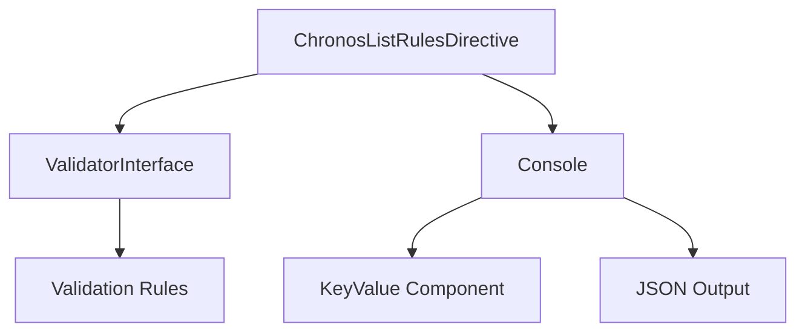

# ChronosListRulesDirective - Référence Technique

## Description

Commande console permettant d'afficher toutes les règles de validation enregistrées, regroupées par type d'entité (Availability, Schedule, Impediment).

## Hiérarchie

```
AbstractDirective
    └── ChronosListRulesDirective
```

Implémente les méthodes abstraites de `AbstractDirective` pour fournir une commande console exécutable.

## Rôle principal

Fournir une visibilité sur les règles de validation configurées dans le système, pour faciliter le débogage, la documentation et la maintenance. La commande supporte plusieurs formats de sortie (texte lisible, JSON, JSON brut) et des filtres par type d'entité.

---

## API

### `getSignature(): string`

Retourne la signature de la commande pour le console.

**Retourne :** `string` - La signature complète avec les arguments et options

**Exemple :**
```php
$directive = new ChronosListRulesDirective();
echo $directive->getSignature();
// chronos:list-rules ::entity->[availability,schedule,impediment]=? ...
```

---

### `getDescription(): string`

Retourne la description de la commande.

**Retourne :** `string` - Description lisible par l'utilisateur

**Exemple :**
```php
echo $directive->getDescription();
// "List all registered validation rules grouped by entity type..."
```

---

### `getAliases(): StringTypedCollection`

Retourne les alias de la commande.

**Retourne :** `StringTypedCollection` - Collection des alias ('rules', 'lr')

**Exemple :**
```php
$aliases = $directive->getAliases();
// Collection: ['rules', 'lr']
```

---

### `execute(): ExitCode`

Exécute la logique principale de la commande.

**Retourne :** `ExitCode` - `ExitCode::SUCCESS` ou `ExitCode::RUNTIME_ERROR`

**Exceptions :** `Throwable` - Si une erreur survient lors de l'exécution

**Exemple :**
```php
$exitCode = $directive->execute();
// ExitCode::SUCCESS
```

---

## Options et Arguments

| Option | Description | Exemple |
|--------|-------------|---------|
| `entity` | Filtrer par type d'entité (availability, schedule, impediment) | `chronos:list-rules availability` |
| `--verbose` | Afficher les informations détaillées (méthodes de la classe) | `chronos:list-rules --verbose` |
| `--json` | Sortie au format JSON | `chronos:list-rules --json` |
| `--raw` | Sortie JSON brut (sans formatage) | `chronos:list-rules --json --raw` |

---

## Cas d'utilisation

### Cas 1 : Lister toutes les règles

```bash
php artisan chronos:list-rules
```

**Sortie :**
```
📋 Laravel Chronos - Validation Rules
  📊 Total: 15 rules across 3 entity types
  🕐 Generated: 2024-01-15 10:30:00

📅 Availability Rules (7)
 1. DaysFormat         At least one day must be specified...
 2. MinimumDuration    Availability duration must be at least 15 minutes...
 3. NoOverlap          Prevents overlapping availabilities...
 ...

📋 Schedule Rules (5)
 1. TimeSlotChronology Start datetime must be before end datetime...
 ...

🚫 Impediment Rules (3)
 1. TimeSlotChronology Start datetime must be before end datetime...
 ...
```

### Cas 2 : Filtrer par type d'entité

```bash
php artisan chronos:list-rules schedule
```

**Sortie :** Affiche uniquement les règles pour l'entité Schedule

```
📋 Laravel Chronos - Validation Rules
  📊 Total: 5 rules across 1 entity type
  🕐 Generated: 2024-01-15 10:30:00

📋 Schedule Rules (5)
 1. EntityOwnership    Ensures schedules belong to the same entity...
 2. TimeSlotChronology Start datetime must be before end datetime...
 ...
```

### Cas 3 : Mode verbose pour le débogage

```bash
php artisan chronos:list-rules --verbose
```

**Sortie :** Affiche les méthodes disponibles pour chaque règle

```
📅 Availability Rules (7)
 1. DaysFormat | Class: AvailabilityDaysFormatRule | Methods: getDescription, supports, validate
 2. MinimumDuration | Class: AvailabilityMinimumDurationRule | Methods: getDescription, supports, validate
 ...
```

### Cas 4 : Export JSON pour intégration

```bash
php artisan chronos:list-rules --json > rules.json
```

**Sortie JSON :**
```json
{
  "availability": {
    "label": "Availability",
    "icon": "📅",
    "total": 7,
    "rules": [
      {
        "index": 1,
        "name": "DaysFormat",
        "class": "AvailabilityDaysFormatRule",
        "description": "Validates that days are properly formatted..."
      }
    ]
  },
  "_meta": {
    "total_entities": 3,
    "total_rules": 15,
    "generated_at": "2024-01-15 10:30:00"
  }
}
```

### Cas 5 : Filtrage avec export JSON

```bash
php artisan chronos:list-rules availability --json
```

**Sortie :** JSON contenant uniquement les règles d'Availability

---

## Gestion des erreurs

| Situation | Exception | Message |
|-----------|-----------|---------|
| Conteneur Laravel non disponible | `Throwable` | `Laravel container is not available` |
| Échec de l'encodage JSON | `RuntimeException` | `Failed to encode JSON` |
| Validateur non trouvé | `Throwable` | Exception du conteneur |
| Commande sans arguments | - | Affiche toutes les entités |

---

## Intégration



La directive s'intègre avec :
- **ValidatorInterface** : Pour récupérer les règles enregistrées
- **Console** : Pour l'affichage formaté
- **KeyValue** : Pour le rendu des données sous forme de paires clé/valeur
- **MapCollection** : Pour la manipulation des données structurées

---

## Performance

| Aspect | Considération |
|--------|---------------|
| **Complexité** | O(n) - Parcourt les règles une seule fois |
| **Mémoire** | Modérée - Charge toutes les règles en mémoire |
| **Cache** | Aucun - Affichage en temps réel |
| **Taille de sortie** | Variable - Dépend du nombre de règles |
| **Recommandation** | Utiliser `--json` pour les intégrations automatiques |

---

## Compatibilité

| Version | Support |
|---------|---------|
| PHP 8.1+ | ✅ Complet |
| PHP 8.0 | ✅ Complet (avec polyfills) |
| Laravel 9.x | ✅ Complet |
| Laravel 10.x | ✅ Complet |
| Laravel 11.x | ✅ Complet |

---

## Exemple complet

```bash
#!/bin/bash

# Afficher toutes les règles avec détails
php artisan chronos:list-rules --verbose

# Exporter en JSON pour analyse
php artisan chronos:list-rules --json > rules_export.json

# Filtrer par type et exporter
php artisan chronos:list-rules availability --json --raw > availability_rules.json
```

```php
<?php

declare(strict_types=1);

use AndyDefer\LaravelChronos\Directives\ChronosListRulesDirective;
use AndyDefer\LaravelChronos\Contracts\Validation\ValidatorInterface;

// Exécution programmatique
$directive = new ChronosListRulesDirective();
$exitCode = $directive->execute();

if ($exitCode === ExitCode::SUCCESS) {
    echo "Rules listed successfully";
}
```

---

## Voir aussi

- `ValidatorInterface` - Interface principale de validation
- `ValidationRule` - Interface des règles de validation
- `AbstractDirective` - Classe parente des directives console
- `EntityType` - Énumération des types d'entités
- `KeyValue` - Composant d'affichage des données