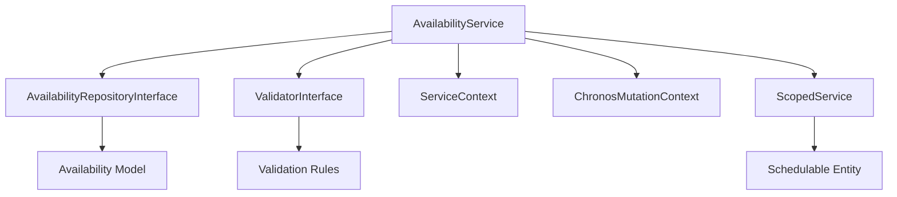

# AvailabilityService - Référence Technique

## Description

Service métier pour la gestion des disponibilités (Availability). Encapsule la logique métier, la validation et le tracking des mutations pour les opérations CRUD sur les disponibilités.

## Hiérarchie

```
AvailabilityService
    └── AvailabilityServiceInterface
```

## Rôle principal

Orchestrer les opérations sur les disponibilités avec :
- Validation des règles métier via `ValidatorInterface`
- Tracking des mutations via `ChronosMutationContext`
- Journalisation des opérations via `ServiceContext`
- Gestion centralisée des exceptions
- **Scoping** via la méthode `for()` pour les opérations sur une entité planifiable

---

## API

### `for(Model $schedulable): self`

Définit le contexte d'entité planifiable pour les opérations suivantes.

| Paramètre | Type | Description |
|-----------|------|-------------|
| `$schedulable` | `Model` | Entité planifiable (ex: `User::find(42)`) |

**Retourne :** `self` - Le service pour le chaînage

**Exemple :**
```php
// Toutes les opérations suivantes sont scopées sur cet utilisateur
$service->for($user)->create($record);
$service->for($user)->findBySchedulable();
```

---

### `create(AvailabilityRecord $record): Availability`

Crée une nouvelle disponibilité.

| Paramètre | Type | Description |
|-----------|------|-------------|
| `$record` | `AvailabilityRecord` | Données de la disponibilité |

**Retourne :** `Availability` - La disponibilité créée

**Exceptions :**
- `ValidationException` - Si la validation échoue
- `Throwable` - Si l'opération échoue

**Exemple :**
```php
$user = User::find(42);
$record = AvailabilityRecord::from([
    'name' => 'Working Hours',
    'type' => 'standard',
    'days' => ['monday', 'tuesday', 'wednesday'],
    'daily_start' => '09:00:00',
    'daily_end' => '17:00:00',
    'validity_start' => '2024-01-01T00:00:00Z',
    'validity_end' => '2024-12-31T23:59:59Z',
]);

// Avec scoping - injecte automatiquement schedulable_type et schedulable_id
$availability = $service->for($user)->create($record);

// Sans scoping - doit spécifier manuellement
$availability = $service->create(AvailabilityRecord::from([
    ...$record->toArray(),
    'schedulable_type' => get_class($user),
    'schedulable_id' => $user->id,
]));
```

---

### `update(int $id, AvailabilityRecord $record): Availability`

Met à jour une disponibilité existante.

| Paramètre | Type | Description |
|-----------|------|-------------|
| `$id` | `int` | ID de la disponibilité |
| `$record` | `AvailabilityRecord` | Nouvelles données |

**Retourne :** `Availability` - La disponibilité mise à jour

**Exceptions :**
- `ModelNotFoundException` - Si la disponibilité n'existe pas
- `ValidationException` - Si la validation échoue
- `Throwable` - Si l'opération échoue

**Exemple :**
```php
$record = AvailabilityRecord::from([
    'name' => 'Updated Working Hours',
    'daily_end' => '18:00:00',
]);

$availability = $service->update(42, $record);
```

---

### `delete(int $id, bool $force = false): bool`

Supprime une disponibilité.

| Paramètre | Type | Description |
|-----------|------|-------------|
| `$id` | `int` | ID de la disponibilité |
| `$force` | `bool` | Suppression forcée (sans validation) |

**Retourne :** `bool` - True si supprimé

**Exceptions :**
- `ModelNotFoundException` - Si la disponibilité n'existe pas
- `ValidationException` - Si la validation échoue (sauf si force=true)
- `Throwable` - Si l'opération échoue

**Exemple :**
```php
// Suppression soft (avec validation)
$service->delete(42);

// Suppression forcée (sans validation)
$service->delete(42, true);
```

---

### `find(int $id): ?Availability`

Trouve une disponibilité par son ID.

| Paramètre | Type | Description |
|-----------|------|-------------|
| `$id` | `int` | ID de la disponibilité |

**Retourne :** `Availability|null` - La disponibilité ou null

**Exemple :**
```php
$availability = $service->find(42);
if ($availability) {
    echo $availability->name;
}
```

---

### `findBySchedulable(?Model $schedulable = null, ?int $limit = null): Collection`

Trouve toutes les disponibilités pour une entité planifiable.

| Paramètre | Type | Description |
|-----------|------|-------------|
| `$schedulable` | `Model|null` | Entité planifiable ou null pour utiliser l'entité scopée |
| `$limit` | `int|null` | Nombre maximum de résultats à retourner |

**Retourne :** `Collection<int, Availability>` - Disponibilités de l'entité

**Exceptions :**
- `RuntimeException` - Si aucun schedulable n'est fourni et aucun n'est scopé

**Exemple :**
```php
// Avec scoping
$user = User::find(42);
$availabilities = $service->for($user)->findBySchedulable();

// Sans scoping
$user = User::find(42);
$availabilities = $service->findBySchedulable($user);

// Avec limite
$availabilities = $service->findBySchedulable($user, 10);
```

---

### `findByType(string $type, ?int $limit = null): Collection`

Trouve les disponibilités par type.

| Paramètre | Type | Description |
|-----------|------|-------------|
| `$type` | `string` | Type de disponibilité |
| `$limit` | `int|null` | Nombre maximum de résultats à retourner |

**Retourne :** `Collection<int, Availability>` - Disponibilités du type

**Exemple :**
```php
$standard = $service->findByType('standard', 10);
```

---

### `findActiveAtDate(Model $schedulable, DateTimeZuluVO $date, ?int $limit = null): Collection`

Trouve les disponibilités actives à une date donnée.

| Paramètre | Type | Description |
|-----------|------|-------------|
| `$schedulable` | `Model` | Entité planifiable |
| `$date` | `DateTimeZuluVO` | Date à vérifier |
| `$limit` | `int|null` | Nombre maximum de résultats à retourner |

**Retourne :** `Collection<int, Availability>` - Disponibilités actives

**Exemple :**
```php
$user = User::find(42);
$today = DateTimeZuluVO::now();
$active = $service->findActiveAtDate($user, $today, 5);
```

---

### `findActiveInDateRange(Model $schedulable, DateTimeZuluVO $start, DateTimeZuluVO $end, ?int $limit = null): Collection`

Trouve les disponibilités actives dans une plage de dates.

| Paramètre | Type | Description |
|-----------|------|-------------|
| `$schedulable` | `Model` | Entité planifiable |
| `$start` | `DateTimeZuluVO` | Début de la plage |
| `$end` | `DateTimeZuluVO` | Fin de la plage |
| `$limit` | `int|null` | Nombre maximum de résultats à retourner |

**Retourne :** `Collection<int, Availability>` - Disponibilités dans la plage

---

### `schedulableExists(Model $schedulable): bool`

Vérifie si une entité planifiable existe.

| Paramètre | Type | Description |
|-----------|------|-------------|
| `$schedulable` | `Model` | Entité planifiable |

**Retourne :** `bool` - True si l'entité existe

**Exemple :**
```php
$user = User::find(42);
if ($service->schedulableExists($user)) {
    echo "L'utilisateur existe";
}
```

---

### `getSchedulableModel(Model $schedulable): ?string`

Retourne la classe du modèle planifiable si l'entité existe.

| Paramètre | Type | Description |
|-----------|------|-------------|
| `$schedulable` | `Model` | Entité planifiable |

**Retourne :** `string|null` - Classe du modèle ou null si inexistante

**Exemple :**
```php
$user = User::find(42);
$class = $service->getSchedulableModel($user);
// 'App\Models\User'
```

---

## Cas d'utilisation

### Cas 1 : Création d'une disponibilité avec scoping

```php
$user = User::find(42);

try {
    $record = AvailabilityRecord::from([
        'name' => 'Heures de travail',
        'type' => 'standard',
        'days' => ['monday', 'tuesday', 'wednesday', 'thursday', 'friday'],
        'daily_start' => '09:00:00',
        'daily_end' => '17:00:00',
        'validity_start' => '2024-01-01T00:00:00Z',
        'validity_end' => '2024-12-31T23:59:59Z',
    ]);

    // Le scoping injecte automatiquement schedulable_type et schedulable_id
    $availability = $service->for($user)->create($record);
    echo "Disponibilité créée avec l'ID: " . $availability->id;

} catch (ValidationException $e) {
    echo "Erreur de validation: " . $e->getMessage();
}
```

### Cas 2 : Récupération des disponibilités d'un utilisateur avec limite

```php
$user = User::find(42);

// Récupère les 10 premières disponibilités de l'utilisateur
$availabilities = $service->for($user)->findBySchedulable(null, 10);

foreach ($availabilities as $availability) {
    echo $availability->name . "\n";
}
```

### Cas 3 : Vérification des disponibilités actives avec limite

```php
$user = User::find(42);
$today = DateTimeZuluVO::now();

// Récupère les 5 premières disponibilités actives aujourd'hui
$active = $service->findActiveAtDate($user, $today, 5);

foreach ($active as $availability) {
    echo $availability->name . " est active aujourd'hui\n";
}
```

### Cas 4 : Suppression d'une disponibilité avec scoping

```php
$user = User::find(42);

try {
    // Vérifie que la disponibilité appartient bien à l'utilisateur
    $service->for($user)->delete(42);
    echo "Disponibilité supprimée avec succès";

} catch (ModelNotFoundException $e) {
    echo "Disponibilité non trouvée ou n'appartient pas à l'utilisateur";
}
```

---

## Gestion des erreurs

| Situation | Exception | Message |
|-----------|-----------|---------|
| Disponibilité inexistante | `ModelNotFoundException` | `Availability with ID X not found` |
| Validation échoue | `ValidationException` | Messages des règles de validation |
| Aucun schedulable défini | `RuntimeException` | `No schedulable entity defined. Use for() or pass a model to findBySchedulable().` |
| Entité planifiable inexistante | `Throwable` | Variable selon le contexte |
| Création échoue | `Throwable` | Variable selon le contexte |
| Mise à jour échoue | `Throwable` | Variable selon le contexte |

---

## Intégration



Le service s'intègre avec :
- **AvailabilityRepositoryInterface** : Pour les opérations de persistance
- **ValidatorInterface** : Pour la validation des règles métier
- **ServiceContext** : Pour le tracking des opérations
- **ChronosMutationContext** : Pour le contrôle des mutations
- **ScopedService** : Pour le scoping des entités planifiables

---

## Performance

| Aspect | Considération |
|--------|---------------|
| **Complexité** | O(1) - Opérations CRUD simples |
| **Validation** | Exécute toutes les règles enregistrées |
| **Scoping** | Vérification d'appartenance pour les opérations |
| **Contexts** | Overhead minimal pour le tracking |
| **Limite** | Utiliser `$limit` pour réduire la charge |
| **Cache** | Non utilisé - données en temps réel |

---

## Compatibilité

| Version | Support |
|---------|---------|
| PHP 8.1+ | ✅ Complet |
| PHP 8.0 | ✅ Complet |
| Laravel 9.x | ✅ Complet |
| Laravel 10.x | ✅ Complet |

---

## Exemple complet

```php
<?php

declare(strict_types=1);

use AndyDefer\LaravelChronos\Services\AvailabilityService;
use AndyDefer\LaravelChronos\Records\AvailabilityRecord;
use AndyDefer\LaravelChronos\ValueObjects\DateTimeZuluVO;
use AndyDefer\LaravelChronos\Exceptions\ValidationException;
use AndyDefer\LaravelChronos\Exceptions\ModelNotFoundException;

$service = $app->make(AvailabilityService::class);
$user = User::find(42);

// 1. Créer une disponibilité avec scoping
try {
    $record = AvailabilityRecord::from([
        'name' => 'Heures de bureau',
        'type' => 'standard',
        'days' => ['monday', 'tuesday', 'wednesday', 'thursday', 'friday'],
        'daily_start' => '09:00:00',
        'daily_end' => '17:00:00',
        'validity_start' => '2024-01-01T00:00:00Z',
        'validity_end' => '2024-12-31T23:59:59Z',
    ]);

    // Le scoping injecte automatiquement schedulable_type et schedulable_id
    $availability = $service->for($user)->create($record);
    echo "Créé: " . $availability->id . "\n";

    // 2. Trouver la disponibilité
    $found = $service->for($user)->find($availability->id);
    echo "Trouvé: " . $found->name . "\n";

    // 3. Récupérer toutes les disponibilités de l'utilisateur (limité à 10)
    $availabilities = $service->for($user)->findBySchedulable(null, 10);
    echo "Disponibilités: " . $availabilities->count() . "\n";

    // 4. Vérifier les disponibilités actives aujourd'hui (limité à 5)
    $today = DateTimeZuluVO::now();
    $active = $service->findActiveAtDate($user, $today, 5);
    echo "Disponibilités actives aujourd'hui: " . $active->count() . "\n";

    // 5. Mettre à jour
    $updateRecord = AvailabilityRecord::from([
        'name' => 'Heures étendues',
        'daily_end' => '18:00:00',
    ]);
    $updated = $service->for($user)->update($availability->id, $updateRecord);
    echo "Mis à jour: " . $updated->name . "\n";

    // 6. Supprimer
    $service->for($user)->delete($availability->id);
    echo "Supprimé\n";

} catch (ValidationException $e) {
    echo "Erreur de validation: " . $e->getMessage() . "\n";
} catch (ModelNotFoundException $e) {
    echo "Ressource non trouvée: " . $e->getMessage() . "\n";
} catch (Throwable $e) {
    echo "Erreur: " . $e->getMessage() . "\n";
}
```

---

## Voir aussi

- `AvailabilityServiceInterface` - Interface du service
- `AvailabilityRepositoryInterface` - Repository des disponibilités
- `ValidatorInterface` - Interface de validation
- `ScopedServiceInterface` - Interface de scoping
- `AvailabilityRecord` - Record de données
- `Availability` - Modèle Eloquent
- `ModelNotFoundException` - Exception métier
- `ValidationException` - Exception de validation
- `ChronosMutationContext` - Contexte de mutation
- `ServiceContext` - Contexte de service