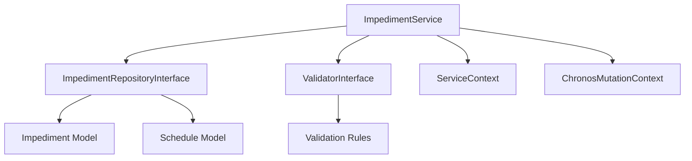

# ImpedimentService - Référence Technique

## Description

Service métier pour la gestion des empêchements (Impediment). Encapsule la logique métier, la validation et le tracking des mutations pour les opérations CRUD sur les empêchements, ainsi que l'analyse de leur impact sur les plannings.

## Hiérarchie

```
ImpedimentService
    └── ImpedimentServiceInterface
```

## Rôle principal

Orchestrer les opérations sur les empêchements avec :
- Validation des règles métier via `ValidatorInterface`
- Tracking des mutations via `ChronosMutationContext`
- Journalisation des opérations via `ServiceContext`
- Analyse d'impact sur les plannings (blocage total/partiel)

---

## API

### `create(ImpedimentRecord $record): Impediment`

Crée un nouvel empêchement.

| Paramètre | Type | Description |
|-----------|------|-------------|
| `$record` | `ImpedimentRecord` | Données de l'empêchement |

**Retourne :** `Impediment` - L'empêchement créé

**Exceptions :**
- `ValidationException` - Si la validation échoue
- `Throwable` - Si l'opération échoue

**Exemple :**
```php
$record = ImpedimentRecord::from([
    'availability_id' => 42,
    'reason' => 'Maintenance technique',
    'start_datetime' => '2024-01-15T10:00:00Z',
    'end_datetime' => '2024-01-15T12:00:00Z',
]);

$impediment = $service->create($record);
```

---

### `update(int $id, ImpedimentRecord $record): Impediment`

Met à jour un empêchement existant.

| Paramètre | Type | Description |
|-----------|------|-------------|
| `$id` | `int` | ID de l'empêchement |
| `$record` | `ImpedimentRecord` | Nouvelles données |

**Retourne :** `Impediment` - L'empêchement mis à jour

**Exceptions :**
- `ModelNotFoundException` - Si l'empêchement n'existe pas
- `ValidationException` - Si la validation échoue
- `Throwable` - Si l'opération échoue

---

### `delete(int $id): bool`

Supprime un empêchement.

| Paramètre | Type | Description |
|-----------|------|-------------|
| `$id` | `int` | ID de l'empêchement |

**Retourne :** `bool` - True si supprimé

**Exceptions :**
- `ModelNotFoundException` - Si l'empêchement n'existe pas
- `ValidationException` - Si la validation échoue
- `Throwable` - Si l'opération échoue

---

### `find(int $id): ?Impediment`

Trouve un empêchement par son ID.

**Retourne :** `Impediment|null` - L'empêchement ou null

---

### `findByAvailability(int $availabilityId): Collection`

Trouve tous les empêchements pour une disponibilité.

| Paramètre | Type | Description |
|-----------|------|-------------|
| `$availabilityId` | `int` | ID de la disponibilité |

**Retourne :** `Collection<int, Impediment>` - Empêchements de la disponibilité

**Exemple :**
```php
$impediments = $service->findByAvailability(42);
```

---

### `findBySchedulable(Model $schedulable): Collection`

Trouve les empêchements pour une entité planifiable (via la disponibilité).

| Paramètre | Type | Description |
|-----------|------|-------------|
| `$schedulable` | `Model` | Entité planifiable (ex: `User::find(42)`) |

**Retourne :** `Collection<int, Impediment>` - Empêchements pour l'entité

**Exemple :**
```php
$user = User::find(42);
$impediments = $service->findBySchedulable($user);
```

---

### `findByDate(DateTimeZuluVO $date, ?int $availabilityId = null): Collection`

Trouve les empêchements pour une date spécifique.

| Paramètre | Type | Description |
|-----------|------|-------------|
| `$date` | `DateTimeZuluVO` | Date à rechercher |
| `$availabilityId` | `int|null` | Filtre par disponibilité |

**Retourne :** `Collection<int, Impediment>` - Empêchements pour la date

---

### `findInDateRange(DateTimeZuluVO $start, DateTimeZuluVO $end, ?int $availabilityId = null): Collection`

Trouve les empêchements dans une plage de dates.

**Retourne :** `Collection<int, Impediment>` - Empêchements dans la plage

---

### `findActive(?int $availabilityId = null): Collection`

Trouve les empêchements actifs (en cours).

| Paramètre | Type | Description |
|-----------|------|-------------|
| `$availabilityId` | `int|null` | Filtre par disponibilité |

**Retourne :** `Collection<int, Impediment>` - Empêchements actifs

**Exemple :**
```php
$active = $service->findActive();
// Empêchements où start <= now <= end
```

---

### `searchByReason(string $search, ?int $availabilityId = null): Collection`

Recherche des empêchements par motif.

| Paramètre | Type | Description |
|-----------|------|-------------|
| `$search` | `string` | Terme de recherche |
| `$availabilityId` | `int|null` | Filtre par disponibilité |

**Retourne :** `Collection<int, Impediment>` - Empêchements correspondants

---

### `isActive(Impediment $impediment): bool`

Vérifie si un empêchement est actif.

| Paramètre | Type | Description |
|-----------|------|-------------|
| `$impediment` | `Impediment` | L'empêchement à vérifier |

**Retourne :** `bool` - True si l'empêchement est actif

**Exemple :**
```php
if ($service->isActive($impediment)) {
    echo "L'empêchement est en cours";
}
```

---

### `overlapsWith(Impediment $impediment, DateTimeZuluVO $start, DateTimeZuluVO $end): bool`

Vérifie si un empêchement chevauche une plage horaire.

| Paramètre | Type | Description |
|-----------|------|-------------|
| `$impediment` | `Impediment` | L'empêchement à vérifier |
| `$start` | `DateTimeZuluVO` | Début de la plage |
| `$end` | `DateTimeZuluVO` | Fin de la plage |

**Retourne :** `bool` - True si chevauchement

---

### `getBlockedSchedules(Impediment $impediment): Collection`

Retourne tous les plannings bloqués par un empêchement.

**Retourne :** `Collection<int, Schedule>` - Plannings bloqués (partiellement ou totalement)

---

### `getFullyBlockedSchedules(Impediment $impediment): Collection`

Retourne les plannings totalement bloqués par un empêchement.

**Retourne :** `Collection<int, Schedule>` - Plannings entièrement dans l'empêchement

---

### `getPartiallyBlockedSchedules(Impediment $impediment): Collection`

Retourne les plannings partiellement bloqués par un empêchement.

**Retourne :** `Collection<int, Schedule>` - Plannings chevauchant partiellement

---

## Cas d'utilisation

### Cas 1 : Création d'un empêchement

```php
try {
    $record = ImpedimentRecord::from([
        'availability_id' => 42,
        'reason' => 'Formation obligatoire',
        'start_datetime' => '2024-01-20T09:00:00Z',
        'end_datetime' => '2024-01-20T17:00:00Z',
    ]);

    $impediment = $service->create($record);
    echo "Empêchement créé avec l'ID: " . $impediment->id;

    $blocked = $service->getBlockedSchedules($impediment);
    echo "Plannings bloqués: " . $blocked->count();

} catch (ValidationException $e) {
    echo "Erreur de validation: " . $e->getMessage();
}
```

### Cas 2 : Analyse d'impact sur les plannings

```php
try {
    $impediment = $service->find(42);
    
    if ($impediment === null) {
        throw new RuntimeException('Empêchement non trouvé');
    }

    $fullyBlocked = $service->getFullyBlockedSchedules($impediment);
    $partiallyBlocked = $service->getPartiallyBlockedSchedules($impediment);

    echo "Plannings totalement bloqués: " . $fullyBlocked->count() . "\n";
    echo "Plannings partiellement bloqués: " . $partiallyBlocked->count() . "\n";

    if ($service->isActive($impediment)) {
        echo "L'empêchement est actif\n";
    }

} catch (ModelNotFoundException $e) {
    echo "Empêchement non trouvé";
}
```

### Cas 3 : Surveillance des empêchements actifs

```php
$active = $service->findActive();

foreach ($active as $impediment) {
    $blocked = $service->getBlockedSchedules($impediment);
    
    if ($blocked->isNotEmpty()) {
        echo "Empêchement #{$impediment->id} bloque " . $blocked->count() . " plannings\n";
        
        foreach ($blocked as $schedule) {
            echo "  - Planning #{$schedule->id}: {$schedule->title}\n";
        }
    }
}
```

---

## Gestion des erreurs

| Situation | Exception | Message |
|-----------|-----------|---------|
| Empêchement inexistant | `ModelNotFoundException` | `Impediment with ID X not found` |
| Validation échoue | `ValidationException` | Messages des règles de validation |
| Création échoue | `Throwable` | Variable selon le contexte |
| Mise à jour échoue | `Throwable` | Variable selon le contexte |
| Suppression échoue | `Throwable` | Variable selon le contexte |

---

## Intégration



Le service s'intègre avec :
- **ImpedimentRepositoryInterface** : Pour les opérations de persistance
- **ValidatorInterface** : Pour la validation des règles métier
- **ServiceContext** : Pour le tracking des opérations
- **ChronosMutationContext** : Pour le contrôle des mutations
- **Schedule Model** : Pour l'analyse d'impact

---

## Performance

| Aspect | Considération |
|--------|---------------|
| **Complexité** | O(1) - Opérations CRUD simples |
| **Analyse d'impact** | O(n) - Parcourt les plannings associés |
| **Validation** | Exécute toutes les règles enregistrées |
| **Contexts** | Overhead minimal pour le tracking |

---

## Compatibilité

| Version | Support |
|---------|---------|
| PHP 8.1+ | ✅ Complet |
| PHP 8.0 | ✅ Complet |
| Laravel 9.x | ✅ Complet |
| Laravel 10.x | ✅ Complet |

---

## Exemple complet

```php
<?php

declare(strict_types=1);

use AndyDefer\LaravelChronos\Services\ImpedimentService;
use AndyDefer\LaravelChronos\Records\ImpedimentRecord;
use AndyDefer\LaravelChronos\ValueObjects\DateTimeZuluVO;
use AndyDefer\LaravelChronos\Exceptions\ValidationException;
use AndyDefer\LaravelChronos\Exceptions\ModelNotFoundException;

$service = $app->make(ImpedimentService::class);

// 1. Créer un empêchement
try {
    $record = ImpedimentRecord::from([
        'availability_id' => 42,
        'reason' => 'Maintenance technique',
        'start_datetime' => '2024-01-15T10:00:00Z',
        'end_datetime' => '2024-01-15T12:00:00Z',
    ]);

    $impediment = $service->create($record);
    echo "Créé: " . $impediment->id . "\n";

    // 2. Trouver l'empêchement
    $found = $service->find($impediment->id);
    echo "Trouvé: " . $found->reason . "\n";

    // 3. Analyser l'impact
    $blocked = $service->getBlockedSchedules($impediment);
    echo "Plannings bloqués: " . $blocked->count() . "\n";

    $fullyBlocked = $service->getFullyBlockedSchedules($impediment);
    $partiallyBlocked = $service->getPartiallyBlockedSchedules($impediment);
    echo "Totalement bloqués: " . $fullyBlocked->count() . "\n";
    echo "Partiellement bloqués: " . $partiallyBlocked->count() . "\n";

    // 4. Vérifier les empêchements actifs
    $active = $service->findActive();
    echo "Empêchements actifs: " . $active->count() . "\n";

    // 5. Supprimer l'empêchement
    $service->delete($impediment->id);
    echo "Supprimé\n";

} catch (ValidationException $e) {
    echo "Erreur de validation: " . $e->getMessage() . "\n";
} catch (ModelNotFoundException $e) {
    echo "Ressource non trouvée: " . $e->getMessage() . "\n";
} catch (Throwable $e) {
    echo "Erreur: " . $e->getMessage() . "\n";
}
```

---

## Voir aussi

- `ImpedimentServiceInterface` - Interface du service
- `ImpedimentRepositoryInterface` - Repository des empêchements
- `ValidatorInterface` - Interface de validation
- `ImpedimentRecord` - Record de données
- `Impediment` - Modèle Eloquent
- `Schedule` - Modèle des plannings
- `ModelNotFoundException` - Exception métier
- `ValidationException` - Exception de validation
- `ChronosMutationContext` - Contexte de mutation
- `ServiceContext` - Contexte de service