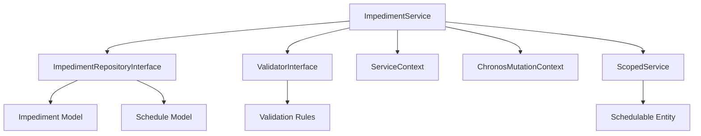

# ImpedimentService - Référence Technique

## Description

Service métier pour la gestion des empêchements (Impediment). Encapsule la logique métier, la validation et le tracking des mutations pour les opérations CRUD sur les empêchements. Les empêchements représentent des blocs ou restrictions sur les disponibilités et peuvent affecter les plannings.

## Hiérarchie

```
ImpedimentService
    └── ImpedimentServiceInterface
```

## Rôle principal

Orchestrer les opérations sur les empêchements avec :
- Validation des règles métier via `ValidatorInterface`
- Tracking des mutations via `ChronosMutationContext`
- Journalisation des opérations via `ServiceContext`
- Gestion centralisée des exceptions
- **Scoping** via la méthode `for()` pour les opérations sur une entité planifiable
- Analyse d'impact sur les plannings

---

## API

### `for(Model $schedulable): self`

Définit le contexte d'entité planifiable pour les opérations suivantes.

| Paramètre | Type | Description |
|-----------|------|-------------|
| `$schedulable` | `Model` | Entité planifiable (ex: `User::find(42)`) |

**Retourne :** `self` - Le service pour le chaînage

**Exemple :**
```php
// Toutes les opérations suivantes sont scopées sur cet utilisateur
$service->for($user)->create($record);
$service->for($user)->findBySchedulable();
```

---

### `create(ImpedimentRecord $record): Impediment`

Crée un nouvel empêchement.

| Paramètre | Type | Description |
|-----------|------|-------------|
| `$record` | `ImpedimentRecord` | Données de l'empêchement |

**Retourne :** `Impediment` - L'empêchement créé

**Exceptions :**
- `ValidationException` - Si la validation échoue
- `Throwable` - Si l'opération échoue

**Exemple :**
```php
$user = User::find(42);
$record = ImpedimentRecord::from([
    'availability_id' => 1,
    'reason' => 'Maintenance technique',
    'start_datetime' => '2024-01-15T10:00:00Z',
    'end_datetime' => '2024-01-15T12:00:00Z',
]);

// Avec scoping
$impediment = $service->for($user)->create($record);

// Sans scoping
$impediment = $service->create($record);
```

---

### `update(int $id, ImpedimentRecord $record): Impediment`

Met à jour un empêchement existant.

| Paramètre | Type | Description |
|-----------|------|-------------|
| `$id` | `int` | ID de l'empêchement |
| `$record` | `ImpedimentRecord` | Nouvelles données |

**Retourne :** `Impediment` - L'empêchement mis à jour

**Exceptions :**
- `ModelNotFoundException` - Si l'empêchement n'existe pas
- `ValidationException` - Si la validation échoue
- `Throwable` - Si l'opération échoue

**Exemple :**
```php
$record = ImpedimentRecord::from([
    'reason' => 'Maintenance prolongée',
    'end_datetime' => '2024-01-15T14:00:00Z',
]);

$impediment = $service->update(42, $record);
```

---

### `delete(int $id): bool`

Supprime un empêchement.

| Paramètre | Type | Description |
|-----------|------|-------------|
| `$id` | `int` | ID de l'empêchement |

**Retourne :** `bool` - True si supprimé

**Exceptions :**
- `ModelNotFoundException` - Si l'empêchement n'existe pas
- `ValidationException` - Si la validation échoue
- `Throwable` - Si l'opération échoue

**Exemple :**
```php
$service->delete(42);
```

---

### `find(int $id): ?Impediment`

Trouve un empêchement par son ID.

| Paramètre | Type | Description |
|-----------|------|-------------|
| `$id` | `int` | ID de l'empêchement |

**Retourne :** `Impediment|null` - L'empêchement ou null

**Exemple :**
```php
$impediment = $service->find(42);
if ($impediment) {
    echo $impediment->reason;
}
```

---

### `findByAvailability(int $availabilityId, ?int $limit = null): Collection`

Trouve tous les empêchements associés à une disponibilité.

| Paramètre | Type | Description |
|-----------|------|-------------|
| `$availabilityId` | `int` | ID de la disponibilité |
| `$limit` | `int|null` | Nombre maximum de résultats à retourner |

**Retourne :** `Collection<int, Impediment>` - Empêchements de la disponibilité

**Exemple :**
```php
$impediments = $service->findByAvailability(42, 10);
```

---

### `findBySchedulable(?Model $schedulable = null, ?int $limit = null): Collection`

Trouve tous les empêchements pour une entité planifiable.

| Paramètre | Type | Description |
|-----------|------|-------------|
| `$schedulable` | `Model|null` | Entité planifiable ou null pour utiliser l'entité scopée |
| `$limit` | `int|null` | Nombre maximum de résultats à retourner |

**Retourne :** `Collection<int, Impediment>` - Empêchements de l'entité

**Exceptions :**
- `RuntimeException` - Si aucun schedulable n'est fourni et aucun n'est scopé

**Exemple :**
```php
// Avec scoping
$user = User::find(42);
$impediments = $service->for($user)->findBySchedulable();

// Sans scoping
$impediments = $service->findBySchedulable($user, 10);
```

---

### `findByDate(DateTimeZuluVO $date, ?int $availabilityId = null, ?int $limit = null): Collection`

Trouve les empêchements pour une date spécifique.

| Paramètre | Type | Description |
|-----------|------|-------------|
| `$date` | `DateTimeZuluVO` | Date à rechercher |
| `$availabilityId` | `int|null` | Filtre par disponibilité |
| `$limit` | `int|null` | Nombre maximum de résultats à retourner |

**Retourne :** `Collection<int, Impediment>` - Empêchements pour la date

**Exemple :**
```php
$date = DateTimeZuluVO::from('2024-01-15T00:00:00Z');
$impediments = $service->findByDate($date, null, 5);
```

---

### `findInDateRange(DateTimeZuluVO $start, DateTimeZuluVO $end, ?int $availabilityId = null, ?int $limit = null): Collection`

Trouve les empêchements dans une plage de dates.

| Paramètre | Type | Description |
|-----------|------|-------------|
| `$start` | `DateTimeZuluVO` | Début de la plage |
| `$end` | `DateTimeZuluVO` | Fin de la plage |
| `$availabilityId` | `int|null` | Filtre par disponibilité |
| `$limit` | `int|null` | Nombre maximum de résultats à retourner |

**Retourne :** `Collection<int, Impediment>` - Empêchements dans la plage

---

### `findActive(?int $availabilityId = null, ?int $limit = null): Collection`

Trouve les empêchements actifs (en cours).

| Paramètre | Type | Description |
|-----------|------|-------------|
| `$availabilityId` | `int|null` | Filtre par disponibilité |
| `$limit` | `int|null` | Nombre maximum de résultats à retourner |

**Retourne :** `Collection<int, Impediment>` - Empêchements actifs

**Exemple :**
```php
$active = $service->findActive(null, 10);
```

---

### `searchByReason(string $search, ?int $availabilityId = null, ?int $limit = null): Collection`

Recherche des empêchements par motif.

| Paramètre | Type | Description |
|-----------|------|-------------|
| `$search` | `string` | Terme de recherche |
| `$availabilityId` | `int|null` | Filtre par disponibilité |
| `$limit` | `int|null` | Nombre maximum de résultats à retourner |

**Retourne :** `Collection<int, Impediment>` - Empêchements correspondants

**Exemple :**
```php
$results = $service->searchByReason('maintenance', null, 10);
```

---

### `isActive(Impediment $impediment): bool`

Vérifie si un empêchement est actif.

| Paramètre | Type | Description |
|-----------|------|-------------|
| `$impediment` | `Impediment` | L'empêchement à vérifier |

**Retourne :** `bool` - True si l'empêchement est actif

**Exemple :**
```php
if ($service->isActive($impediment)) {
    echo "L'empêchement est en cours";
}
```

---

### `overlapsWith(Impediment $impediment, DateTimeZuluVO $start, DateTimeZuluVO $end): bool`

Vérifie si un empêchement chevauche une plage horaire.

| Paramètre | Type | Description |
|-----------|------|-------------|
| `$impediment` | `Impediment` | L'empêchement à vérifier |
| `$start` | `DateTimeZuluVO` | Début de la plage |
| `$end` | `DateTimeZuluVO` | Fin de la plage |

**Retourne :** `bool` - True s'il y a chevauchement

---

### `getBlockedSchedules(Impediment $impediment, ?int $limit = null): Collection`

Retourne tous les plannings bloqués par un empêchement.

| Paramètre | Type | Description |
|-----------|------|-------------|
| `$impediment` | `Impediment` | L'empêchement à analyser |
| `$limit` | `int|null` | Nombre maximum de résultats à retourner |

**Retourne :** `Collection<int, Schedule>` - Plannings bloqués

---

### `getFullyBlockedSchedules(Impediment $impediment, ?int $limit = null): Collection`

Retourne les plannings totalement bloqués par un empêchement.

| Paramètre | Type | Description |
|-----------|------|-------------|
| `$impediment` | `Impediment` | L'empêchement à analyser |
| `$limit` | `int|null` | Nombre maximum de résultats à retourner |

**Retourne :** `Collection<int, Schedule>` - Plannings entièrement bloqués

---

### `getPartiallyBlockedSchedules(Impediment $impediment, ?int $limit = null): Collection`

Retourne les plannings partiellement bloqués par un empêchement.

| Paramètre | Type | Description |
|-----------|------|-------------|
| `$impediment` | `Impediment` | L'empêchement à analyser |
| `$limit` | `int|null` | Nombre maximum de résultats à retourner |

**Retourne :** `Collection<int, Schedule>` - Plannings partiellement bloqués

---

## Cas d'utilisation

### Cas 1 : Création d'un empêchement avec scoping

```php
$user = User::find(42);

try {
    $record = ImpedimentRecord::from([
        'availability_id' => 1,
        'reason' => 'Maintenance technique',
        'start_datetime' => '2024-01-15T10:00:00Z',
        'end_datetime' => '2024-01-15T12:00:00Z',
    ]);

    $impediment = $service->for($user)->create($record);
    echo "Empêchement créé avec l'ID: " . $impediment->id;

} catch (ValidationException $e) {
    echo "Erreur de validation: " . $e->getMessage();
}
```

### Cas 2 : Analyse d'impact sur les plannings

```php
$impediment = $service->find(42);

$fullyBlocked = $service->getFullyBlockedSchedules($impediment, 10);
$partiallyBlocked = $service->getPartiallyBlockedSchedules($impediment, 10);

echo "Plannings totalement bloqués: " . $fullyBlocked->count() . "\n";
echo "Plannings partiellement bloqués: " . $partiallyBlocked->count() . "\n";
```

### Cas 3 : Recherche des empêchements actifs avec limite

```php
$active = $service->findActive(null, 5);

foreach ($active as $impediment) {
    echo "Empêchement actif: " . $impediment->reason . "\n";
    $blocked = $service->getBlockedSchedules($impediment, 5);
    echo "  Plannings bloqués: " . $blocked->count() . "\n";
}
```

### Cas 4 : Suppression avec vérification d'appartenance

```php
$user = User::find(42);

try {
    // Vérifie que l'empêchement appartient bien à l'utilisateur
    $service->for($user)->delete(42);
    echo "Empêchement supprimé avec succès";

} catch (ModelNotFoundException $e) {
    echo "Empêchement non trouvé ou n'appartient pas à l'utilisateur";
}
```

---

## Gestion des erreurs

| Situation | Exception | Message |
|-----------|-----------|---------|
| Empêchement inexistant | `ModelNotFoundException` | `Impediment with ID X not found` |
| Validation échoue | `ValidationException` | Messages des règles de validation |
| Aucun schedulable défini | `RuntimeException` | `No schedulable entity defined. Use for() or pass a model to findBySchedulable().` |
| Création échoue | `Throwable` | Variable selon le contexte |
| Mise à jour échoue | `Throwable` | Variable selon le contexte |

---

## Intégration



Le service s'intègre avec :
- **ImpedimentRepositoryInterface** : Pour les opérations de persistance
- **ValidatorInterface** : Pour la validation des règles métier
- **ServiceContext** : Pour le tracking des opérations
- **ChronosMutationContext** : Pour le contrôle des mutations
- **ScopedService** : Pour le scoping des entités planifiables

---

## Performance

| Aspect | Considération |
|--------|---------------|
| **Complexité** | O(1) - Opérations CRUD simples |
| **Validation** | Exécute toutes les règles enregistrées |
| **Scoping** | Vérification d'appartenance via la disponibilité |
| **Analyse d'impact** | Requêtes sur les plannings - utiliser `$limit` |
| **Contexts** | Overhead minimal pour le tracking |
| **Limite** | Utiliser `$limit` pour réduire la charge |
| **Cache** | Non utilisé - données en temps réel |

---

## Compatibilité

| Version | Support |
|---------|---------|
| PHP 8.1+ | ✅ Complet |
| PHP 8.0 | ✅ Complet |
| Laravel 9.x | ✅ Complet |
| Laravel 10.x | ✅ Complet |

---

## Exemple complet

```php
<?php

declare(strict_types=1);

use AndyDefer\LaravelChronos\Services\ImpedimentService;
use AndyDefer\LaravelChronos\Records\ImpedimentRecord;
use AndyDefer\LaravelChronos\ValueObjects\DateTimeZuluVO;
use AndyDefer\LaravelChronos\Exceptions\ValidationException;
use AndyDefer\LaravelChronos\Exceptions\ModelNotFoundException;

$service = $app->make(ImpedimentService::class);
$user = User::find(42);

// 1. Créer un empêchement avec scoping
try {
    $record = ImpedimentRecord::from([
        'availability_id' => 1,
        'reason' => 'Maintenance technique',
        'start_datetime' => '2024-01-15T10:00:00Z',
        'end_datetime' => '2024-01-15T12:00:00Z',
    ]);

    $impediment = $service->for($user)->create($record);
    echo "Créé: " . $impediment->id . "\n";

    // 2. Trouver l'empêchement
    $found = $service->for($user)->find($impediment->id);
    echo "Trouvé: " . $found->reason . "\n";

    // 3. Récupérer les empêchements de l'utilisateur (limité à 10)
    $impediments = $service->for($user)->findBySchedulable(null, 10);
    echo "Empêchements: " . $impediments->count() . "\n";

    // 4. Vérifier les empêchements actifs (limité à 5)
    $active = $service->findActive(null, 5);
    echo "Empêchements actifs: " . $active->count() . "\n";

    // 5. Mettre à jour
    $updateRecord = ImpedimentRecord::from([
        'reason' => 'Maintenance prolongée',
        'end_datetime' => '2024-01-15T14:00:00Z',
    ]);
    $updated = $service->for($user)->update($impediment->id, $updateRecord);
    echo "Mis à jour: " . $updated->reason . "\n";

    // 6. Analyser l'impact (limité à 10)
    $blocked = $service->getBlockedSchedules($impediment, 10);
    echo "Plannings bloqués: " . $blocked->count() . "\n";

    // 7. Supprimer
    $service->for($user)->delete($impediment->id);
    echo "Supprimé\n";

} catch (ValidationException $e) {
    echo "Erreur de validation: " . $e->getMessage() . "\n";
} catch (ModelNotFoundException $e) {
    echo "Ressource non trouvée: " . $e->getMessage() . "\n";
} catch (Throwable $e) {
    echo "Erreur: " . $e->getMessage() . "\n";
}
```

---

## Voir aussi

- `ImpedimentServiceInterface` - Interface du service
- `ImpedimentRepositoryInterface` - Repository des empêchements
- `ValidatorInterface` - Interface de validation
- `ScopedServiceInterface` - Interface de scoping
- `ImpedimentRecord` - Record de données
- `Impediment` - Modèle Eloquent
- `Schedule` - Modèle des plannings
- `ModelNotFoundException` - Exception métier
- `ValidationException` - Exception de validation
- `ChronosMutationContext` - Contexte de mutation
- `ServiceContext` - Contexte de service