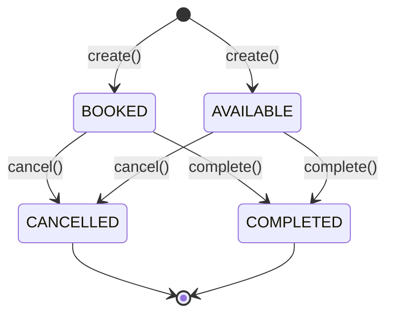
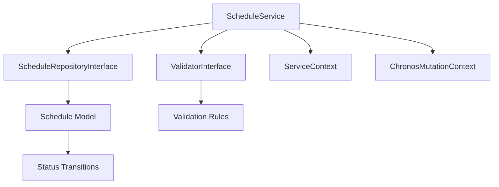

# ScheduleService - Référence Technique

## Description

Service métier pour la gestion des plannings (Schedule). Encapsule la logique métier, la validation, le tracking des mutations et les transitions d'état (annulation, complétion) pour les opérations CRUD sur les plannings.

## Hiérarchie

```
ScheduleService
    └── ScheduleServiceInterface
```

## Rôle principal

Orchestrer les opérations sur les plannings avec :
- Validation des règles métier via `ValidatorInterface`
- Tracking des mutations via `ChronosMutationContext`
- Journalisation des opérations via `ServiceContext`
- Transitions d'état (cancel, complete)
- Validation des conditions de transition

---

## API

### `create(ScheduleRecord $record): Schedule`

Crée un nouveau planning.

| Paramètre | Type | Description |
|-----------|------|-------------|
| `$record` | `ScheduleRecord` | Données du planning |

**Retourne :** `Schedule` - Le planning créé

**Exceptions :**
- `ValidationException` - Si la validation échoue
- `Throwable` - Si l'opération échoue

**Exemple :**
```php
$user = User::find(1);
$record = ScheduleRecord::from([
    'availability_id' => 42,
    'schedulable_type' => get_class($user),
    'schedulable_id' => $user->id,
    'title' => 'Réunion d\'équipe',
    'status' => ScheduleStatus::BOOKED,
    'start_datetime' => '2024-01-15T10:00:00Z',
    'end_datetime' => '2024-01-15T11:00:00Z',
]);

$schedule = $service->create($record);
```

---

### `update(int $id, ScheduleRecord $record): Schedule`

Met à jour un planning existant.

| Paramètre | Type | Description |
|-----------|------|-------------|
| `$id` | `int` | ID du planning |
| `$record` | `ScheduleRecord` | Nouvelles données |

**Retourne :** `Schedule` - Le planning mis à jour

**Exceptions :**
- `ModelNotFoundException` - Si le planning n'existe pas
- `ValidationException` - Si la validation échoue
- `Throwable` - Si l'opération échoue

---

### `delete(int $id): bool`

Supprime un planning.

| Paramètre | Type | Description |
|-----------|------|-------------|
| `$id` | `int` | ID du planning |

**Retourne :** `bool` - True si supprimé

**Exceptions :**
- `ModelNotFoundException` - Si le planning n'existe pas
- `ValidationException` - Si la validation échoue
- `Throwable` - Si l'opération échoue

---

### `find(int $id): ?Schedule`

Trouve un planning par son ID.

**Retourne :** `Schedule|null` - Le planning ou null

---

### `findByAvailability(int $availabilityId): Collection`

Trouve tous les plannings pour une disponibilité.

| Paramètre | Type | Description |
|-----------|------|-------------|
| `$availabilityId` | `int` | ID de la disponibilité |

**Retourne :** `Collection<int, Schedule>` - Plannings de la disponibilité

---

### `findBySchedulable(Model $schedulable): Collection`

Trouve les plannings pour une entité planifiable.

| Paramètre | Type | Description |
|-----------|------|-------------|
| `$schedulable` | `Model` | Entité planifiable (ex: `User::find(42)`) |

**Retourne :** `Collection<int, Schedule>` - Plannings pour l'entité

**Exemple :**
```php
$user = User::find(42);
$schedules = $service->findBySchedulable($user);
```

---

### `findByStatus(ScheduleStatus $status, ?int $availabilityId = null): Collection`

Trouve les plannings par statut.

| Paramètre | Type | Description |
|-----------|------|-------------|
| `$status` | `ScheduleStatus` | Statut (BOOKED, AVAILABLE, CANCELLED, COMPLETED) |
| `$availabilityId` | `int|null` | Filtre par disponibilité |

**Retourne :** `Collection<int, Schedule>` - Plannings avec le statut

**Exemple :**
```php
$booked = $service->findByStatus(ScheduleStatus::BOOKED);
$cancelled = $service->findByStatus(ScheduleStatus::CANCELLED, 42);
```

---

### `findByDate(DateTimeZuluVO $date, ?int $availabilityId = null): Collection`

Trouve les plannings pour une date spécifique.

| Paramètre | Type | Description |
|-----------|------|-------------|
| `$date` | `DateTimeZuluVO` | Date à rechercher |
| `$availabilityId` | `int|null` | Filtre par disponibilité |

**Retourne :** `Collection<int, Schedule>` - Plannings pour la date

---

### `findInDateRange(DateTimeZuluVO $start, DateTimeZuluVO $end, ?int $availabilityId = null): Collection`

Trouve les plannings dans une plage de dates.

**Retourne :** `Collection<int, Schedule>` - Plannings dans la plage

---

### `searchByTitle(string $search, ?int $availabilityId = null): Collection`

Recherche des plannings par titre.

| Paramètre | Type | Description |
|-----------|------|-------------|
| `$search` | `string` | Terme de recherche |
| `$availabilityId` | `int|null` | Filtre par disponibilité |

**Retourne :** `Collection<int, Schedule>` - Plannings correspondants

---

### `cancel(int $id): Schedule`

Annule un planning.

| Paramètre | Type | Description |
|-----------|------|-------------|
| `$id` | `int` | ID du planning |

**Retourne :** `Schedule` - Le planning annulé (statut CANCELLED)

**Exceptions :**
- `ModelNotFoundException` - Si le planning n'existe pas
- `ValidationException` - Si le planning ne peut pas être annulé
- `Throwable` - Si l'opération échoue

**Exemple :**
```php
$cancelled = $service->cancel(42);
echo "Planning annulé: " . $cancelled->status->value;
```

---

### `complete(int $id): Schedule`

Marque un planning comme complété.

| Paramètre | Type | Description |
|-----------|------|-------------|
| `$id` | `int` | ID du planning |

**Retourne :** `Schedule` - Le planning complété (statut COMPLETED)

**Exceptions :**
- `ModelNotFoundException` - Si le planning n'existe pas
- `ValidationException` - Si le planning ne peut pas être complété
- `Throwable` - Si l'opération échoue

**Exemple :**
```php
$completed = $service->complete(42);
echo "Planning complété: " . $completed->status->value;
```

---

### `canBeCancelled(Schedule $schedule): bool`

Vérifie si un planning peut être annulé.

| Paramètre | Type | Description |
|-----------|------|-------------|
| `$schedule` | `Schedule` | Le planning à vérifier |

**Retourne :** `bool` - True si annulable

**Exemple :**
```php
if ($service->canBeCancelled($schedule)) {
    $service->cancel($schedule->id);
}
```

---

### `canBeCompleted(Schedule $schedule): bool`

Vérifie si un planning peut être complété.

| Paramètre | Type | Description |
|-----------|------|-------------|
| `$schedule` | `Schedule` | Le planning à vérifier |

**Retourne :** `bool` - True si complétable

**Exemple :**
```php
if ($service->canBeCompleted($schedule)) {
    $service->complete($schedule->id);
}
```

---

## Transitions d'état



**Règles de transition :**
- `cancel()` : Un planning peut être annulé s'il n'est pas déjà CANCELLED ou COMPLETED
- `complete()` : Un planning peut être complété s'il n'est pas déjà CANCELLED ou COMPLETED

---

## Cas d'utilisation

### Cas 1 : Création d'un planning avec validation

```php
try {
    $user = User::find(1);
    $record = ScheduleRecord::from([
        'availability_id' => 42,
        'schedulable_type' => get_class($user),
        'schedulable_id' => $user->id,
        'title' => 'Formation PHP',
        'status' => ScheduleStatus::BOOKED,
        'start_datetime' => '2024-01-20T09:00:00Z',
        'end_datetime' => '2024-01-20T17:00:00Z',
    ]);

    $schedule = $service->create($record);
    echo "Planning créé avec l'ID: " . $schedule->id;

} catch (ValidationException $e) {
    echo "Erreur de validation: " . $e->getMessage();
}
```

### Cas 2 : Annulation d'un planning

```php
try {
    $schedule = $service->find(42);
    
    if ($schedule === null) {
        throw new RuntimeException('Planning non trouvé');
    }

    if ($service->canBeCancelled($schedule)) {
        $cancelled = $service->cancel($schedule->id);
        echo "Planning annulé avec succès";
    } else {
        echo "Le planning ne peut pas être annulé (statut: " . $schedule->status->value . ")";
    }

} catch (ModelNotFoundException $e) {
    echo "Planning non trouvé";
} catch (ValidationException $e) {
    echo "Impossible d'annuler: " . $e->getMessage();
}
```

### Cas 3 : Gestion des statuts

```php
$booked = $service->findByStatus(ScheduleStatus::BOOKED);

foreach ($booked as $schedule) {
    $now = DateTimeZuluVO::now();
    
    if ($schedule->end_datetime < $now) {
        if ($service->canBeCompleted($schedule)) {
            $service->complete($schedule->id);
            echo "Planning #{$schedule->id} complété\n";
        }
    }
    
    if ($schedule->start_datetime->diffInHours($now) < 2) {
        if ($service->canBeCancelled($schedule)) {
            echo "Planning #{$schedule->id} peut encore être annulé\n";
        }
    }
}
```

### Cas 4 : Recherche par entité planifiable

```php
$user = User::find(42);
$schedules = $service->findBySchedulable($user);

foreach ($schedules as $schedule) {
    echo $schedule->title . " - " . $schedule->status->value . "\n";
}
```

---

## Gestion des erreurs

| Situation | Exception | Message |
|-----------|-----------|---------|
| Planning inexistant | `ModelNotFoundException` | `Schedule with ID X not found` |
| Validation échoue | `ValidationException` | Messages des règles de validation |
| Annulation impossible | `ValidationException` | `Schedule cannot be cancelled. Current status: X` |
| Complétion impossible | `ValidationException` | `Schedule cannot be completed. Current status: X` |
| Création échoue | `Throwable` | Variable selon le contexte |

---

## Intégration



Le service s'intègre avec :
- **ScheduleRepositoryInterface** : Pour les opérations de persistance
- **ValidatorInterface** : Pour la validation des règles métier
- **ServiceContext** : Pour le tracking des opérations
- **ChronosMutationContext** : Pour le contrôle des mutations
- **Schedule Model** : Pour les transitions d'état

---

## Performance

| Aspect | Considération |
|--------|---------------|
| **Complexité** | O(1) - Opérations CRUD simples |
| **Transitions** | O(1) - Mise à jour du statut |
| **Validation** | Exécute toutes les règles enregistrées |
| **Contexts** | Overhead minimal pour le tracking |

---

## Compatibilité

| Version | Support |
|---------|---------|
| PHP 8.1+ | ✅ Complet |
| PHP 8.0 | ✅ Complet |
| Laravel 9.x | ✅ Complet |
| Laravel 10.x | ✅ Complet |

---

## Exemple complet

```php
<?php

declare(strict_types=1);

use AndyDefer\LaravelChronos\Services\ScheduleService;
use AndyDefer\LaravelChronos\Enums\ScheduleStatus;
use AndyDefer\LaravelChronos\Records\ScheduleRecord;
use AndyDefer\LaravelChronos\ValueObjects\DateTimeZuluVO;
use AndyDefer\LaravelChronos\Exceptions\ValidationException;
use AndyDefer\LaravelChronos\Exceptions\ModelNotFoundException;

$service = $app->make(ScheduleService::class);
$user = User::find(1);

// 1. Créer un planning
try {
    $record = ScheduleRecord::from([
        'availability_id' => 42,
        'schedulable_type' => get_class($user),
        'schedulable_id' => $user->id,
        'title' => 'Réunion d\'équipe',
        'status' => ScheduleStatus::BOOKED,
        'start_datetime' => '2024-01-15T10:00:00Z',
        'end_datetime' => '2024-01-15T11:00:00Z',
    ]);

    $schedule = $service->create($record);
    echo "Créé: " . $schedule->id . "\n";

    // 2. Trouver le planning
    $found = $service->find($schedule->id);
    echo "Trouvé: " . $found->title . "\n";

    // 3. Vérifier les statuts
    $booked = $service->findByStatus(ScheduleStatus::BOOKED);
    echo "Plannings bookés: " . $booked->count() . "\n";

    // 4. Annuler le planning
    if ($service->canBeCancelled($schedule)) {
        $cancelled = $service->cancel($schedule->id);
        echo "Annulé: " . $cancelled->status->value . "\n";
    }

    // 5. Recherche par entité
    $userSchedules = $service->findBySchedulable($user);
    echo "Plannings de l'utilisateur: " . $userSchedules->count() . "\n";

} catch (ValidationException $e) {
    echo "Erreur de validation: " . $e->getMessage() . "\n";
} catch (ModelNotFoundException $e) {
    echo "Ressource non trouvée: " . $e->getMessage() . "\n";
} catch (Throwable $e) {
    echo "Erreur: " . $e->getMessage() . "\n";
}
```

---

## Voir aussi

- `ScheduleServiceInterface` - Interface du service
- `ScheduleRepositoryInterface` - Repository des plannings
- `ValidatorInterface` - Interface de validation
- `ScheduleRecord` - Record de données
- `Schedule` - Modèle Eloquent
- `ScheduleStatus` - Énumération des statuts
- `ModelNotFoundException` - Exception métier
- `ValidationException` - Exception de validation
- `ChronosMutationContext` - Contexte de mutation
- `ServiceContext` - Contexte de service