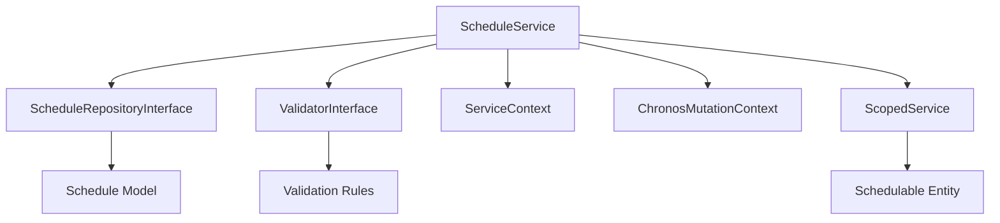

# ScheduleService - Référence Technique

## Description

Service métier pour la gestion des plannings (Schedule). Encapsule la logique métier, la validation et le tracking des mutations pour les opérations CRUD sur les plannings. Gère également les transitions de statut (annulation, complétion) et les vérifications de règles métier associées.

## Hiérarchie

```
ScheduleService
    └── ScheduleServiceInterface
```

## Rôle principal

Orchestrer les opérations sur les plannings avec :
- Validation des règles métier via `ValidatorInterface`
- Tracking des mutations via `ChronosMutationContext`
- Journalisation des opérations via `ServiceContext`
- Gestion centralisée des exceptions
- **Scoping** via la méthode `for()` pour les opérations sur une entité planifiable
- **Transitions de statut** : Annulation et complétion avec validation des règles métier

---

## API

### `for(Model $schedulable): self`

Définit le contexte d'entité planifiable pour les opérations suivantes.

| Paramètre | Type | Description |
|-----------|------|-------------|
| `$schedulable` | `Model` | Entité planifiable (ex: `User::find(42)`) |

**Retourne :** `self` - Le service pour le chaînage

**Exemple :**
```php
// Toutes les opérations suivantes sont scopées sur cet utilisateur
$service->for($user)->create($record);
$service->for($user)->findBySchedulable();
```

---

### `create(ScheduleRecord $record): Schedule`

Crée un nouveau planning.

| Paramètre | Type | Description |
|-----------|------|-------------|
| `$record` | `ScheduleRecord` | Données du planning |

**Retourne :** `Schedule` - Le planning créé

**Exceptions :**
- `ValidationException` - Si la validation échoue
- `Throwable` - Si l'opération échoue

**Exemple :**
```php
$user = User::find(42);
$record = ScheduleRecord::from([
    'availability_id' => 1,
    'title' => 'Réunion d\'équipe',
    'start_datetime' => '2024-01-15T10:00:00Z',
    'end_datetime' => '2024-01-15T11:00:00Z',
    'status' => ScheduleStatus::BOOKED,
]);

// Avec scoping - injecte automatiquement schedulable_type et schedulable_id
$schedule = $service->for($user)->create($record);

// Sans scoping
$schedule = $service->create(ScheduleRecord::from([
    ...$record->toArray(),
    'schedulable_type' => get_class($user),
    'schedulable_id' => $user->id,
]));
```

---

### `update(int $id, ScheduleRecord $record): Schedule`

Met à jour un planning existant.

| Paramètre | Type | Description |
|-----------|------|-------------|
| `$id` | `int` | ID du planning |
| `$record` | `ScheduleRecord` | Nouvelles données |

**Retourne :** `Schedule` - Le planning mis à jour

**Exceptions :**
- `ModelNotFoundException` - Si le planning n'existe pas
- `ValidationException` - Si la validation échoue
- `Throwable` - Si l'opération échoue

**Exemple :**
```php
$record = ScheduleRecord::from([
    'title' => 'Réunion reportée',
    'start_datetime' => '2024-01-15T14:00:00Z',
]);

$schedule = $service->update(42, $record);
```

---

### `delete(int $id): bool`

Supprime un planning.

| Paramètre | Type | Description |
|-----------|------|-------------|
| `$id` | `int` | ID du planning |

**Retourne :** `bool` - True si supprimé

**Exceptions :**
- `ModelNotFoundException` - Si le planning n'existe pas
- `ValidationException` - Si la validation échoue
- `Throwable` - Si l'opération échoue

**Exemple :**
```php
$service->delete(42);
```

---

### `find(int $id): ?Schedule`

Trouve un planning par son ID.

| Paramètre | Type | Description |
|-----------|------|-------------|
| `$id` | `int` | ID du planning |

**Retourne :** `Schedule|null` - Le planning ou null

**Exemple :**
```php
$schedule = $service->find(42);
if ($schedule) {
    echo $schedule->title;
}
```

---

### `findByAvailability(int $availabilityId, ?int $limit = null): Collection`

Trouve tous les plannings associés à une disponibilité.

| Paramètre | Type | Description |
|-----------|------|-------------|
| `$availabilityId` | `int` | ID de la disponibilité |
| `$limit` | `int|null` | Nombre maximum de résultats à retourner |

**Retourne :** `Collection<int, Schedule>` - Plannings de la disponibilité

**Exemple :**
```php
$schedules = $service->findByAvailability(42, 10);
```

---

### `findBySchedulable(?Model $schedulable = null, ?int $limit = null): Collection`

Trouve tous les plannings pour une entité planifiable.

| Paramètre | Type | Description |
|-----------|------|-------------|
| `$schedulable` | `Model|null` | Entité planifiable ou null pour utiliser l'entité scopée |
| `$limit` | `int|null` | Nombre maximum de résultats à retourner |

**Retourne :** `Collection<int, Schedule>` - Plannings de l'entité

**Exceptions :**
- `RuntimeException` - Si aucun schedulable n'est fourni et aucun n'est scopé

**Exemple :**
```php
// Avec scoping
$user = User::find(42);
$schedules = $service->for($user)->findBySchedulable();

// Sans scoping
$schedules = $service->findBySchedulable($user, 10);
```

---

### `findByStatus(ScheduleStatus $status, ?int $availabilityId = null, ?int $limit = null): Collection`

Trouve les plannings par statut.

| Paramètre | Type | Description |
|-----------|------|-------------|
| `$status` | `ScheduleStatus` | Statut (BOOKED, AVAILABLE, CANCELLED, COMPLETED) |
| `$availabilityId` | `int|null` | Filtre par disponibilité |
| `$limit` | `int|null` | Nombre maximum de résultats à retourner |

**Retourne :** `Collection<int, Schedule>` - Plannings avec le statut

**Exemple :**
```php
$booked = $service->findByStatus(ScheduleStatus::BOOKED, null, 10);
```

---

### `findByDate(DateTimeZuluVO $date, ?int $availabilityId = null, ?int $limit = null): Collection`

Trouve les plannings pour une date spécifique.

| Paramètre | Type | Description |
|-----------|------|-------------|
| `$date` | `DateTimeZuluVO` | Date à rechercher |
| `$availabilityId` | `int|null` | Filtre par disponibilité |
| `$limit` | `int|null` | Nombre maximum de résultats à retourner |

**Retourne :** `Collection<int, Schedule>` - Plannings pour la date

---

### `findInDateRange(DateTimeZuluVO $start, DateTimeZuluVO $end, ?int $availabilityId = null, ?int $limit = null): Collection`

Trouve les plannings dans une plage de dates.

| Paramètre | Type | Description |
|-----------|------|-------------|
| `$start` | `DateTimeZuluVO` | Début de la plage |
| `$end` | `DateTimeZuluVO` | Fin de la plage |
| `$availabilityId` | `int|null` | Filtre par disponibilité |
| `$limit` | `int|null` | Nombre maximum de résultats à retourner |

**Retourne :** `Collection<int, Schedule>` - Plannings dans la plage

---

### `searchByTitle(string $search, ?int $availabilityId = null, ?int $limit = null): Collection`

Recherche des plannings par titre.

| Paramètre | Type | Description |
|-----------|------|-------------|
| `$search` | `string` | Terme de recherche |
| `$availabilityId` | `int|null` | Filtre par disponibilité |
| `$limit` | `int|null` | Nombre maximum de résultats à retourner |

**Retourne :** `Collection<int, Schedule>` - Plannings correspondants

**Exemple :**
```php
$results = $service->searchByTitle('réunion', null, 10);
```

---

### `cancel(int $id): Schedule`

Annule un planning (passe le statut à CANCELLED).

| Paramètre | Type | Description |
|-----------|------|-------------|
| `$id` | `int` | ID du planning |

**Retourne :** `Schedule` - Le planning annulé

**Exceptions :**
- `ModelNotFoundException` - Si le planning n'existe pas
- `ValidationException` - Si le planning ne peut pas être annulé
- `Throwable` - Si l'opération échoue

**Règles métier :**
- Ne peut pas annuler un planning déjà annulé
- Ne peut pas annuler un planning déjà complété

**Exemple :**
```php
$cancelled = $service->cancel(42);
echo "Planning annulé: " . $cancelled->status->value;
```

---

### `complete(int $id): Schedule`

Complète un planning (passe le statut à COMPLETED).

| Paramètre | Type | Description |
|-----------|------|-------------|
| `$id` | `int` | ID du planning |

**Retourne :** `Schedule` - Le planning complété

**Exceptions :**
- `ModelNotFoundException` - Si le planning n'existe pas
- `ValidationException` - Si le planning ne peut pas être complété
- `Throwable` - Si l'opération échoue

**Règles métier :**
- Ne peut compléter qu'un planning avec statut BOOKED
- Ne peut compléter qu'un planning passé (end_datetime < now)

**Exemple :**
```php
$completed = $service->complete(42);
echo "Planning complété: " . $completed->status->value;
```

---

### `canBeCancelled(Schedule $schedule): bool`

Vérifie si un planning peut être annulé.

| Paramètre | Type | Description |
|-----------|------|-------------|
| `$schedule` | `Schedule` | Le planning à vérifier |

**Retourne :** `bool` - True si le planning peut être annulé

**Exemple :**
```php
if ($service->canBeCancelled($schedule)) {
    $service->cancel($schedule->id);
}
```

---

### `canBeCompleted(Schedule $schedule): bool`

Vérifie si un planning peut être complété.

| Paramètre | Type | Description |
|-----------|------|-------------|
| `$schedule` | `Schedule` | Le planning à vérifier |

**Retourne :** `bool` - True si le planning peut être complété

**Exemple :**
```php
if ($service->canBeCompleted($schedule)) {
    $service->complete($schedule->id);
}
```

---

## Cas d'utilisation

### Cas 1 : Création d'un planning avec scoping

```php
$user = User::find(42);

try {
    $record = ScheduleRecord::from([
        'availability_id' => 1,
        'title' => 'Réunion d\'équipe',
        'start_datetime' => '2024-01-15T10:00:00Z',
        'end_datetime' => '2024-01-15T11:00:00Z',
        'status' => ScheduleStatus::BOOKED,
    ]);

    $schedule = $service->for($user)->create($record);
    echo "Planning créé avec l'ID: " . $schedule->id;

} catch (ValidationException $e) {
    echo "Erreur de validation: " . $e->getMessage();
}
```

### Cas 2 : Annulation d'un planning

```php
try {
    $schedule = $service->find(42);
    
    if ($service->canBeCancelled($schedule)) {
        $cancelled = $service->cancel($schedule->id);
        echo "Planning annulé";
    } else {
        echo "Ce planning ne peut pas être annulé";
    }

} catch (ModelNotFoundException $e) {
    echo "Planning non trouvé";
} catch (ValidationException $e) {
    echo "Erreur: " . $e->getMessage();
}
```

### Cas 3 : Complétion des plannings passés

```php
$booked = $service->findByStatus(ScheduleStatus::BOOKED, null, 20);

foreach ($booked as $schedule) {
    if ($service->canBeCompleted($schedule)) {
        try {
            $service->complete($schedule->id);
            echo "Planning #{$schedule->id} complété\n";
        } catch (ValidationException $e) {
            echo "Erreur pour le planning #{$schedule->id}: " . $e->getMessage() . "\n";
        }
    }
}
```

### Cas 4 : Recherche avec limite

```php
$user = User::find(42);

// Récupère les 10 prochains plannings de l'utilisateur
$schedules = $service->for($user)->findBySchedulable(null, 10);

foreach ($schedules as $schedule) {
    echo $schedule->title . " - " . $schedule->status->getLabel() . "\n";
}
```

---

## Gestion des erreurs

| Situation | Exception | Message |
|-----------|-----------|---------|
| Planning inexistant | `ModelNotFoundException` | `Schedule with ID X not found` |
| Validation échoue | `ValidationException` | Messages des règles de validation |
| Annulation impossible | `ValidationException` | `Schedule cannot be cancelled. Current status: X` |
| Complétion impossible | `ValidationException` | `Schedule cannot be completed. Current status: X` |
| Aucun schedulable défini | `RuntimeException` | `No schedulable entity defined. Use for() or pass a model to findBySchedulable().` |

---

## Intégration



Le service s'intègre avec :
- **ScheduleRepositoryInterface** : Pour les opérations de persistance
- **ValidatorInterface** : Pour la validation des règles métier
- **ServiceContext** : Pour le tracking des opérations
- **ChronosMutationContext** : Pour le contrôle des mutations
- **ScopedService** : Pour le scoping des entités planifiables

---

## Performance

| Aspect | Considération |
|--------|---------------|
| **Complexité** | O(1) - Opérations CRUD simples |
| **Validation** | Exécute toutes les règles enregistrées |
| **Scoping** | Vérification d'appartenance pour les opérations |
| **Transitions** | Vérification des règles métier avant changement |
| **Contexts** | Overhead minimal pour le tracking |
| **Limite** | Utiliser `$limit` pour réduire la charge |
| **Cache** | Non utilisé - données en temps réel |

---

## Compatibilité

| Version | Support |
|---------|---------|
| PHP 8.1+ | ✅ Complet |
| PHP 8.0 | ✅ Complet |
| Laravel 9.x | ✅ Complet |
| Laravel 10.x | ✅ Complet |

---

## Exemple complet

```php
<?php

declare(strict_types=1);

use AndyDefer\LaravelChronos\Services\ScheduleService;
use AndyDefer\LaravelChronos\Records\ScheduleRecord;
use AndyDefer\LaravelChronos\Enums\ScheduleStatus;
use AndyDefer\LaravelChronos\ValueObjects\DateTimeZuluVO;
use AndyDefer\LaravelChronos\Exceptions\ValidationException;
use AndyDefer\LaravelChronos\Exceptions\ModelNotFoundException;

$service = $app->make(ScheduleService::class);
$user = User::find(42);

try {
    // 1. Créer un planning avec scoping
    $record = ScheduleRecord::from([
        'availability_id' => 1,
        'title' => 'Réunion d\'équipe',
        'start_datetime' => '2024-01-15T10:00:00Z',
        'end_datetime' => '2024-01-15T11:00:00Z',
        'status' => ScheduleStatus::BOOKED,
    ]);

    $schedule = $service->for($user)->create($record);
    echo "Créé: " . $schedule->id . "\n";

    // 2. Trouver le planning
    $found = $service->for($user)->find($schedule->id);
    echo "Trouvé: " . $found->title . "\n";

    // 3. Récupérer les plannings de l'utilisateur (limité à 10)
    $schedules = $service->for($user)->findBySchedulable(null, 10);
    echo "Plannings: " . $schedules->count() . "\n";

    // 4. Vérifier les plannings par statut (limité à 5)
    $booked = $service->findByStatus(ScheduleStatus::BOOKED, null, 5);
    echo "Plannings réservés: " . $booked->count() . "\n";

    // 5. Rechercher par titre
    $results = $service->searchByTitle('réunion', null, 5);
    echo "Résultats de recherche: " . $results->count() . "\n";

    // 6. Annuler le planning
    if ($service->canBeCancelled($schedule)) {
        $cancelled = $service->cancel($schedule->id);
        echo "Annulé: " . $cancelled->status->value . "\n";
    }

    // 7. Compléter le planning (si BOOKED et passé)
    if ($service->canBeCompleted($schedule)) {
        $completed = $service->complete($schedule->id);
        echo "Complété: " . $completed->status->value . "\n";
    }

    // 8. Supprimer
    $service->for($user)->delete($schedule->id);
    echo "Supprimé\n";

} catch (ValidationException $e) {
    echo "Erreur de validation: " . $e->getMessage() . "\n";
} catch (ModelNotFoundException $e) {
    echo "Ressource non trouvée: " . $e->getMessage() . "\n";
} catch (Throwable $e) {
    echo "Erreur: " . $e->getMessage() . "\n";
}
```

---

## Voir aussi

- `ScheduleServiceInterface` - Interface du service
- `ScheduleRepositoryInterface` - Repository des plannings
- `ValidatorInterface` - Interface de validation
- `ScopedServiceInterface` - Interface de scoping
- `ScheduleRecord` - Record de données
- `Schedule` - Modèle Eloquent
- `ScheduleStatus` - Énumération des statuts
- `ModelNotFoundException` - Exception métier
- `ValidationException` - Exception de validation
- `ChronosMutationContext` - Contexte de mutation
- `ServiceContext` - Contexte de service