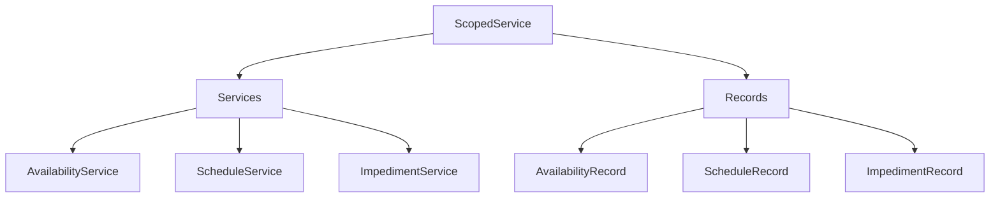

# ScopedService - Référence Technique

## Description

Service utilitaire pour la gestion du contexte d'entité planifiable (scoping). Permet de définir une entité planifiable (ex: User, Doctor) et d'injecter automatiquement ses informations (type et ID) dans les données des opérations suivantes.

## Hiérarchie

```
ScopedService
    └── ScopedServiceInterface
```

## Rôle principal

Encapsuler la logique de scoping pour :
- Définir une entité planifiable comme contexte
- Injecter automatiquement `schedulable_type` et `schedulable_id` dans les données
- Vérifier l'état du scoping
- Nettoyer le contexte après utilisation

---

## API

### `for(Model $schedulable): self`

Définit l'entité planifiable comme contexte pour les opérations suivantes.

| Paramètre | Type | Description |
|-----------|------|-------------|
| `$schedulable` | `Model` | Entité planifiable (ex: `User::find(42)`) |

**Retourne :** `self` - Le service pour le chaînage

**Exemple :**
```php
$scope = new ScopedService();
$scope->for($user);
```

---

### `getScopedSchedulable(): ?Model`

Retourne l'entité planifiable actuellement scopée.

**Retourne :** `Model|null` - L'entité scopée ou null

**Exemple :**
```php
$schedulable = $scope->getScopedSchedulable();
if ($schedulable) {
    echo get_class($schedulable);
}
```

---

### `clearScope(): self`

Efface le contexte d'entité planifiable actuel.

**Retourne :** `self` - Le service pour le chaînage

**Exemple :**
```php
$scope->clearScope();
```

---

### `isScoped(): bool`

Vérifie si une entité planifiable est définie comme contexte.

**Retourne :** `bool` - True si une entité est scopée

**Exemple :**
```php
if ($scope->isScoped()) {
    echo "Une entité est définie comme contexte";
}
```

---

### `getScopedSchedulableType(): ?string`

Retourne le type (morph class) de l'entité planifiable scopée.

**Retourne :** `string|null` - Le type de l'entité ou null

**Exemple :**
```php
$type = $scope->getScopedSchedulableType();
// 'App\Models\User' ou null
```

---

### `getScopedSchedulableId(): ?int`

Retourne l'ID de l'entité planifiable scopée.

**Retourne :** `int|null` - L'ID de l'entité ou null

**Exemple :**
```php
$id = $scope->getScopedSchedulableId();
// 42 ou null
```

---

### `injectScopedData(array $data): array`

Injecte les données de l'entité scopée (`schedulable_type` et `schedulable_id`) dans un tableau de données.

| Paramètre | Type | Description |
|-----------|------|-------------|
| `$data` | `array` | Tableau de données existant |

**Retourne :** `array` - Tableau de données enrichi

**Exemple :**
```php
$data = ['name' => 'Working Hours'];
$enriched = $scope->injectScopedData($data);
// ['name' => 'Working Hours', 'schedulable_type' => 'App\Models\User', 'schedulable_id' => 42]
```

---

### `with(Model $schedulable, callable $callback): mixed`

Exécute une fonction avec un contexte d'entité planifiable, puis nettoie automatiquement le contexte.

| Paramètre | Type | Description |
|-----------|------|-------------|
| `$schedulable` | `Model` | Entité planifiable |
| `$callback` | `callable` | Fonction à exécuter |

**Retourne :** `mixed` - Le résultat de la fonction

**Exemple :**
```php
$result = $scope->with($user, function () use ($scope) {
    // Le contexte est défini
    $data = $scope->injectScopedData(['name' => 'Test']);
    // Le contexte est automatiquement nettoyé après
});
```

---

## Cas d'utilisation

### Cas 1 : Scoping dans un service

```php
class AvailabilityService
{
    private ScopedServiceInterface $scope;

    public function for(Model $schedulable): self
    {
        $this->scope->for($schedulable);
        return $this;
    }

    public function create(AvailabilityRecord $record): Availability
    {
        // Injection automatique si scopé
        $record = $this->injectScopedDataIntoRecord($record);
        // ...
    }

    private function injectScopedDataIntoRecord(AvailabilityRecord $record): AvailabilityRecord
    {
        if (! $this->scope->isScoped()) {
            return $record;
        }

        $data = $record->toArray();
        $data['schedulable_type'] = $this->scope->getScopedSchedulableType();
        $data['schedulable_id'] = $this->scope->getScopedSchedulableId();

        $this->scope->clearScope();

        return AvailabilityRecord::from($data);
    }
}
```

### Cas 2 : Injection de données

```php
$scope = new ScopedService();
$scope->for($user);

$data = [
    'name' => 'Working Hours',
    'daily_start' => '09:00:00',
    'daily_end' => '17:00:00',
];

// Injection automatique
$enriched = $scope->injectScopedData($data);
// [
//     'name' => 'Working Hours',
//     'daily_start' => '09:00:00',
//     'daily_end' => '17:00:00',
//     'schedulable_type' => 'App\Models\User',
//     'schedulable_id' => 42
// ]
```

### Cas 3 : Vérification du contexte

```php
$scope = new ScopedService();

if (! $scope->isScoped()) {
    throw new RuntimeException('No schedulable entity defined. Use for().');
}

$type = $scope->getScopedSchedulableType();
$id = $scope->getScopedSchedulableId();

echo "Contexte: $type #$id";
```

### Cas 4 : Exécution avec nettoyage automatique

```php
$scope = new ScopedService();

$result = $scope->with($user, function () use ($scope) {
    // Le contexte est défini
    $data = $scope->injectScopedData(['name' => 'Test']);
    return $data;
});

// Le contexte est automatiquement nettoyé
// $scope->isScoped() === false
```

---

## Gestion des erreurs

| Situation | Comportement |
|-----------|--------------|
| Aucun schedulable défini | Les méthodes retournent null |
| Injection sans contexte | Retourne les données inchangées |
| with() avec callback | Nettoie automatiquement après l'exécution |

---

## Intégration



Le service s'intègre avec :
- **AvailabilityService** : Injection automatique pour les disponibilités
- **ScheduleService** : Injection automatique pour les plannings
- **ImpedimentService** : Injection automatique pour les empêchements
- **Records** : Enrichissement des données avant persistance

---

## Performance

| Aspect | Considération |
|--------|---------------|
| **Complexité** | O(1) - Opérations simples |
| **Mémoire** | Stockage d'une seule entité |
| **Injection** | Simple ajout de deux clés dans un tableau |
| **Nettoyage** | Automatique avec `with()` |

---

## Compatibilité

| Version | Support |
|---------|---------|
| PHP 8.1+ | ✅ Complet |
| PHP 8.0 | ✅ Complet |
| Laravel 9.x | ✅ Complet |
| Laravel 10.x | ✅ Complet |

---

## Exemple complet

```php
<?php

declare(strict_types=1);

use AndyDefer\LaravelChronos\Services\ScopedService;

$scope = new ScopedService();

// 1. Définir le contexte
$user = User::find(42);
$scope->for($user);

// 2. Vérifier le contexte
if ($scope->isScoped()) {
    echo "Contexte défini\n";
    echo "Type: " . $scope->getScopedSchedulableType() . "\n";
    echo "ID: " . $scope->getScopedSchedulableId() . "\n";
}

// 3. Injecter des données
$data = [
    'name' => 'Working Hours',
    'daily_start' => '09:00:00',
    'daily_end' => '17:00:00',
];

$enriched = $scope->injectScopedData($data);
print_r($enriched);
// [
//     'name' => 'Working Hours',
//     'daily_start' => '09:00:00',
//     'daily_end' => '17:00:00',
//     'schedulable_type' => 'App\Models\User',
//     'schedulable_id' => 42
// ]

// 4. Nettoyer le contexte
$scope->clearScope();

// 5. Utiliser with() pour un nettoyage automatique
$result = $scope->with($user, function () use ($scope) {
    return $scope->injectScopedData(['name' => 'Test']);
});
// Le contexte est automatiquement nettoyé

// 6. Vérifier que le contexte est vide
if (! $scope->isScoped()) {
    echo "Contexte vidé\n";
}
```

---

## Voir aussi

- `ScopedServiceInterface` - Interface du service
- `AvailabilityService` - Service des disponibilités
- `ScheduleService` - Service des plannings
- `ImpedimentService` - Service des empêchements
- `AvailabilityRecord` - Record de disponibilité
- `ScheduleRecord` - Record de planning
- `ImpedimentRecord` - Record d'empêchement