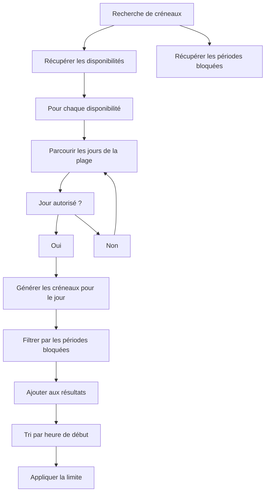

# SlotService - Référence Technique

## Description

Service métier pour la recherche et la génération de créneaux disponibles (slots). Implémente la logique de planification en trouvant des créneaux horaires disponibles dans les disponibilités, en tenant compte des plannings et des empêchements comme bloqueurs.

## Hiérarchie

```
SlotService
    └── SlotServiceInterface
```

## Rôle principal

Orchestrer la recherche de créneaux disponibles avec :
- Recherche du prochain créneau disponible
- Recherche des créneaux dans une plage de dates
- Analyse des périodes bloquées (plannings + empêchements)
- Génération de créneaux à partir d'un créneau existant
- Validation des durées minimales

---

## API

### `findNextSlot(Model $schedulable, DateTimeZuluVO $after, int $durationInMinutes, ?int $availabilityId = null): ?SlotVO`

Trouve le prochain créneau disponible après une date donnée.

| Paramètre | Type | Description |
|-----------|------|-------------|
| `$schedulable` | `Model` | Entité planifiable |
| `$after` | `DateTimeZuluVO` | Date après laquelle chercher |
| `$durationInMinutes` | `int` | Durée requise du créneau (minutes) |
| `$availabilityId` | `int|null` | Disponibilité spécifique à rechercher |

**Retourne :** `SlotVO|null` - Le prochain créneau disponible ou null

**Exceptions :**
- `InvalidArgumentException` - Si la durée est trop courte

**Exemple :**
```php
$user = User::find(42);
$after = DateTimeZuluVO::now();
$slot = $service->findNextSlot($user, $after, 30);
// Slot de 30 minutes à partir de 09:00
```

---

### `findPreviousSlot(Model $schedulable, DateTimeZuluVO $before, int $durationInMinutes, ?int $availabilityId = null): ?SlotVO`

Trouve le dernier créneau disponible avant une date donnée.

| Paramètre | Type | Description |
|-----------|------|-------------|
| `$schedulable` | `Model` | Entité planifiable |
| `$before` | `DateTimeZuluVO` | Date avant laquelle chercher |
| `$durationInMinutes` | `int` | Durée requise du créneau (minutes) |
| `$availabilityId` | `int|null` | Disponibilité spécifique à rechercher |

**Retourne :** `SlotVO|null` - Le dernier créneau disponible ou null

**Exemple :**
```php
$user = User::find(42);
$before = DateTimeZuluVO::now();
$slot = $service->findPreviousSlot($user, $before, 30);
```

---

### `findSlotsInRange(Model $schedulable, DateTimeZuluVO $start, DateTimeZuluVO $end, int $durationInMinutes, ?int $availabilityId = null, ?int $limit = null): SlotVOCollection`

Trouve tous les créneaux disponibles dans une plage de dates.

| Paramètre | Type | Description |
|-----------|------|-------------|
| `$schedulable` | `Model` | Entité planifiable |
| `$start` | `DateTimeZuluVO` | Début de la plage |
| `$end` | `DateTimeZuluVO` | Fin de la plage |
| `$durationInMinutes` | `int` | Durée requise de chaque créneau (minutes) |
| `$availabilityId` | `int|null` | Disponibilité spécifique à rechercher |
| `$limit` | `int|null` | Nombre maximum de créneaux à retourner |

**Retourne :** `SlotVOCollection` - Collection de créneaux triés par heure de début

**Exemple :**
```php
$user = User::find(42);
$start = DateTimeZuluVO::from('2024-01-15T00:00:00Z');
$end = DateTimeZuluVO::from('2024-01-15T23:59:59Z');
$slots = $service->findSlotsInRange($user, $start, $end, 30, null, 10);
```

---

### `findSlotsForDay(Model $schedulable, DateTimeZuluVO $date, int $durationInMinutes, ?int $availabilityId = null, ?int $limit = null): SlotVOCollection`

Trouve tous les créneaux disponibles pour une journée spécifique.

| Paramètre | Type | Description |
|-----------|------|-------------|
| `$schedulable` | `Model` | Entité planifiable |
| `$date` | `DateTimeZuluVO` | Date à rechercher |
| `$durationInMinutes` | `int` | Durée requise de chaque créneau (minutes) |
| `$availabilityId` | `int|null` | Disponibilité spécifique à rechercher |
| `$limit` | `int|null` | Nombre maximum de créneaux à retourner |

**Retourne :** `SlotVOCollection` - Collection de créneaux pour la journée

**Exemple :**
```php
$user = User::find(42);
$date = DateTimeZuluVO::today();
$slots = $service->findSlotsForDay($user, $date, 30, null, 5);
```

---

### `isSlotAvailable(Model $schedulable, DateTimeZuluVO $start, DateTimeZuluVO $end, ?int $availabilityId = null): bool`

Vérifie si un créneau spécifique est disponible.

| Paramètre | Type | Description |
|-----------|------|-------------|
| `$schedulable` | `Model` | Entité planifiable |
| `$start` | `DateTimeZuluVO` | Début du créneau |
| `$end` | `DateTimeZuluVO` | Fin du créneau |
| `$availabilityId` | `int|null` | Disponibilité spécifique à vérifier |

**Retourne :** `bool` - True si le créneau exact est disponible

**Exemple :**
```php
$user = User::find(42);
$start = DateTimeZuluVO::from('2024-01-15T10:00:00Z');
$end = DateTimeZuluVO::from('2024-01-15T10:30:00Z');
$isAvailable = $service->isSlotAvailable($user, $start, $end);
```

---

### `getNextAvailableStart(Model $schedulable, DateTimeZuluVO $after, int $durationInMinutes, ?int $availabilityId = null): ?DateTimeZuluVO`

Trouve la prochaine heure de début disponible pour une durée donnée.

| Paramètre | Type | Description |
|-----------|------|-------------|
| `$schedulable` | `Model` | Entité planifiable |
| `$after` | `DateTimeZuluVO` | Date après laquelle chercher |
| `$durationInMinutes` | `int` | Durée requise (minutes) |
| `$availabilityId` | `int|null` | Disponibilité spécifique à rechercher |

**Retourne :** `DateTimeZuluVO|null` - La prochaine heure de début ou null

**Exemple :**
```php
$user = User::find(42);
$after = DateTimeZuluVO::now();
$start = $service->getNextAvailableStart($user, $after, 30);
```

---

### `hasAvailabilityOnDate(Model $schedulable, DateTimeZuluVO $date): bool`

Vérifie si une entité a des disponibilités à une date donnée.

| Paramètre | Type | Description |
|-----------|------|-------------|
| `$schedulable` | `Model` | Entité planifiable |
| `$date` | `DateTimeZuluVO` | Date à vérifier |

**Retourne :** `bool` - True si l'entité a des disponibilités

**Exemple :**
```php
$user = User::find(42);
$date = DateTimeZuluVO::today();
if ($service->hasAvailabilityOnDate($user, $date)) {
    echo "L'utilisateur a des disponibilités aujourd'hui";
}
```

---

### `getBlockedPeriods(Model $schedulable, DateTimeZuluVO $start, DateTimeZuluVO $end, ?int $availabilityId = null, ?int $limit = null): BlockedPeriodCollection`

Récupère toutes les périodes bloquées dans une plage de dates.

| Paramètre | Type | Description |
|-----------|------|-------------|
| `$schedulable` | `Model` | Entité planifiable |
| `$start` | `DateTimeZuluVO` | Début de la plage |
| `$end` | `DateTimeZuluVO` | Fin de la plage |
| `$availabilityId` | `int|null` | Disponibilité spécifique à analyser |
| `$limit` | `int|null` | Nombre maximum de périodes à retourner |

**Retourne :** `BlockedPeriodCollection` - Collection de périodes bloquées

**Exemple :**
```php
$user = User::find(42);
$start = DateTimeZuluVO::from('2024-01-15T00:00:00Z');
$end = DateTimeZuluVO::from('2024-01-15T23:59:59Z');
$blocked = $service->getBlockedPeriods($user, $start, $end, null, 10);
```

---

### `generateSlotsFromSlot(SlotVO $slot, int $chunkDuration, ?int $limit = null): SlotVOCollection`

Génère des créneaux plus petits à partir d'un créneau existant.

| Paramètre | Type | Description |
|-----------|------|-------------|
| `$slot` | `SlotVO` | Créneau à diviser |
| `$chunkDuration` | `int` | Durée de chaque morceau (minutes) |
| `$limit` | `int|null` | Nombre maximum de créneaux à retourner |

**Retourne :** `SlotVOCollection` - Collection de créneaux plus petits

**Exemple :**
```php
$start = DateTimeZuluVO::from('2024-01-15T09:00:00Z');
$slot = SlotVO::fromDuration($start, 60);
$slots = $service->generateSlotsFromSlot($slot, 30);
// 2 créneaux de 30 minutes
```

---

## Cas d'utilisation

### Cas 1 : Recherche du prochain créneau disponible

```php
$user = User::find(42);
$after = DateTimeZuluVO::now();

try {
    $slot = $service->findNextSlot($user, $after, 30);
    
    if ($slot) {
        echo "Prochain créneau disponible: " . $slot->getStart()->getValue() . "\n";
        echo "Fin: " . $slot->getEnd()->getValue() . "\n";
        echo "Durée: " . $slot->getDurationFormatted() . "\n";
    } else {
        echo "Aucun créneau disponible dans les " . SlotService::DEFAULT_SEARCH_DAYS . " jours\n";
    }
} catch (InvalidArgumentException $e) {
    echo "Erreur: " . $e->getMessage();
}
```

### Cas 2 : Récupération des créneaux d'une journée

```php
$user = User::find(42);
$date = DateTimeZuluVO::today();

$slots = $service->findSlotsForDay($user, $date, 30, null, 10);

foreach ($slots as $slot) {
    echo $slot->getStart()->toTimeString() . " - " . $slot->getEnd()->toTimeString() . "\n";
}
```

### Cas 3 : Vérification de disponibilité

```php
$user = User::find(42);
$start = DateTimeZuluVO::from('2024-01-15T10:00:00Z');
$end = DateTimeZuluVO::from('2024-01-15T10:30:00Z');

if ($service->isSlotAvailable($user, $start, $end)) {
    echo "Le créneau est disponible\n";
} else {
    echo "Le créneau n'est pas disponible\n";
}
```

### Cas 4 : Analyse des périodes bloquées

```php
$user = User::find(42);
$start = DateTimeZuluVO::from('2024-01-15T00:00:00Z');
$end = DateTimeZuluVO::from('2024-01-15T23:59:59Z');

$blocked = $service->getBlockedPeriods($user, $start, $end);

echo "Périodes bloquées:\n";
foreach ($blocked as $period) {
    echo $period->getStart()->toTimeString() . " - " . $period->getEnd()->toTimeString();
    echo " (" . $period->getType() . "#" . $period->getId() . ")\n";
}
```

### Cas 5 : Génération de créneaux depuis un créneau existant

```php
$start = DateTimeZuluVO::from('2024-01-15T09:00:00Z');
$slot = SlotVO::fromDuration($start, 60);

$chunks = $service->generateSlotsFromSlot($slot, 15, 4);

foreach ($chunks as $chunk) {
    echo $chunk->getStart()->toTimeString() . " - " . $chunk->getEnd()->toTimeString() . "\n";
}
// 09:00 - 09:15
// 09:15 - 09:30
// 09:30 - 09:45
// 09:45 - 10:00
```

---

## Gestion des erreurs

| Situation | Exception | Message |
|-----------|-----------|---------|
| Durée trop courte | `InvalidArgumentException` | `Duration (X minutes) is too short. Minimum allowed duration for slot search is Y minutes.` |

---

## Algorithme de recherche de créneaux



---

## Performance

| Aspect | Considération |
|--------|---------------|
| **Recherche** | Parcours des jours sur 30 jours par défaut |
| **Disponibilités** | Chargement complet des disponibilités |
| **Bloqueurs** | Chargement des plannings et empêchements |
| **Génération** | Création de nombreux objets SlotVO |
| **Limite** | Réduit les résultats retournés mais pas les calculs internes |
| **Optimisation** | Utiliser `$availabilityId` pour réduire le périmètre |

---

## Compatibilité

| Version | Support |
|---------|---------|
| PHP 8.1+ | ✅ Complet |
| PHP 8.0 | ✅ Complet |
| Laravel 9.x | ✅ Complet |
| Laravel 10.x | ✅ Complet |

---

## Exemple complet

```php
<?php

declare(strict_types=1);

use AndyDefer\LaravelChronos\Services\SlotService;
use AndyDefer\LaravelChronos\ValueObjects\DateTimeZuluVO;
use AndyDefer\LaravelChronos\ValueObjects\SlotVO;

$service = $app->make(SlotService::class);
$user = User::find(42);

try {
    // 1. Recherche du prochain créneau de 30 minutes
    $after = DateTimeZuluVO::now();
    $nextSlot = $service->findNextSlot($user, $after, 30);
    
    if ($nextSlot) {
        echo "Prochain créneau: " . $nextSlot . "\n";
    }

    // 2. Recherche des créneaux du jour (limité à 5)
    $today = DateTimeZuluVO::today();
    $slots = $service->findSlotsForDay($user, $today, 30, null, 5);
    echo "Créneaux du jour (" . $slots->count() . "):\n";
    foreach ($slots as $slot) {
        echo "  " . $slot . "\n";
    }

    // 3. Vérification d'un créneau spécifique
    $start = DateTimeZuluVO::from('2024-01-15T10:00:00Z');
    $end = DateTimeZuluVO::from('2024-01-15T10:30:00Z');
    if ($service->isSlotAvailable($user, $start, $end)) {
        echo "Le créneau est disponible\n";
    }

    // 4. Analyse des périodes bloquées
    $rangeStart = DateTimeZuluVO::from('2024-01-15T00:00:00Z');
    $rangeEnd = DateTimeZuluVO::from('2024-01-15T23:59:59Z');
    $blocked = $service->getBlockedPeriods($user, $rangeStart, $rangeEnd);
    echo "Périodes bloquées (" . $blocked->count() . "):\n";
    foreach ($blocked as $period) {
        echo "  " . $period->getStart()->toTimeString() . " - " . $period->getEnd()->toTimeString();
        echo " (" . $period->getType() . ")\n";
    }

} catch (InvalidArgumentException $e) {
    echo "Erreur: " . $e->getMessage() . "\n";
}
```

---

## Voir aussi

- `SlotServiceInterface` - Interface du service
- `AvailabilityServiceInterface` - Service des disponibilités
- `ScheduleServiceInterface` - Service des plannings
- `ImpedimentServiceInterface` - Service des empêchements
- `SlotVO` - Value Object des créneaux
- `BlockedPeriodVO` - Value Object des périodes bloquées
- `BlockedPeriodCollection` - Collection des périodes bloquées
- `SlotVOCollection` - Collection des créneaux
- `DateTimeZuluVO` - Value Object des dates