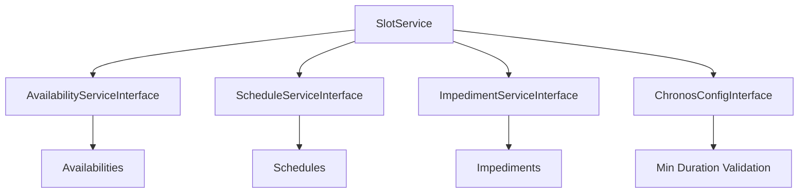

# SlotService - Référence Technique

## Description

Service métier pour la recherche et la génération de créneaux horaires disponibles (slots). Implémente le moteur de planification principal qui trouve des créneaux dans les disponibilités en tenant compte des plannings et des empêchements comme bloqueurs.

## Hiérarchie

```
SlotService
    └── SlotServiceInterface
```

## Rôle principal

Orchestrer la recherche de créneaux disponibles avec :
- Calcul des disponibilités par jour
- Prise en compte des bloqueurs (schedules, impediments)
- Gestion des plages cross-day (chevauchant minuit)
- Validation de la durée minimale pour éviter les recherches trop granulaires
- Génération de créneaux découpés

---

## API

### `findNextSlot(Model $schedulable, DateTimeZuluVO $after, int $durationInMinutes, ?int $availabilityId = null): ?SlotVO`

Trouve le prochain créneau disponible après une heure donnée.

| Paramètre | Type | Description |
|-----------|------|-------------|
| `$schedulable` | `Model` | Entité planifiable (ex: `User::find(42)`) |
| `$after` | `DateTimeZuluVO` | Heure de début de recherche |
| `$durationInMinutes` | `int` | Durée requise en minutes |
| `$availabilityId` | `int|null` | Filtre par disponibilité spécifique |

**Retourne :** `SlotVO|null` - Le prochain créneau disponible ou null

**Exceptions :** `InvalidArgumentException` - Si la durée est trop courte

**Exemple :**
```php
$user = User::find(42);
$slot = $service->findNextSlot($user, DateTimeZuluVO::now(), 30);
```

---

### `findPreviousSlot(Model $schedulable, DateTimeZuluVO $before, int $durationInMinutes, ?int $availabilityId = null): ?SlotVO`

Trouve le dernier créneau disponible avant une heure donnée.

| Paramètre | Type | Description |
|-----------|------|-------------|
| `$schedulable` | `Model` | Entité planifiable |
| `$before` | `DateTimeZuluVO` | Heure de fin de recherche |
| `$durationInMinutes` | `int` | Durée requise en minutes |
| `$availabilityId` | `int|null` | Filtre par disponibilité spécifique |

**Retourne :** `SlotVO|null` - Le dernier créneau disponible ou null

---

### `findSlotsInRange(Model $schedulable, DateTimeZuluVO $start, DateTimeZuluVO $end, int $durationInMinutes, ?int $availabilityId = null): SlotVOCollection`

Trouve tous les créneaux disponibles dans une plage de dates.

| Paramètre | Type | Description |
|-----------|------|-------------|
| `$schedulable` | `Model` | Entité planifiable |
| `$start` | `DateTimeZuluVO` | Début de la plage |
| `$end` | `DateTimeZuluVO` | Fin de la plage |
| `$durationInMinutes` | `int` | Durée requise en minutes |
| `$availabilityId` | `int|null` | Filtre par disponibilité spécifique |

**Retourne :** `SlotVOCollection` - Collection de créneaux triés par heure de début

**Exemple :**
```php
$user = User::find(42);
$slots = $service->findSlotsInRange(
    $user,
    DateTimeZuluVO::from('2024-01-15T00:00:00Z'),
    DateTimeZuluVO::from('2024-01-15T23:59:59Z'),
    30
);
```

---

### `findSlotsForDay(Model $schedulable, DateTimeZuluVO $date, int $durationInMinutes, ?int $availabilityId = null): SlotVOCollection`

Trouve tous les créneaux disponibles pour un jour donné.

| Paramètre | Type | Description |
|-----------|------|-------------|
| `$schedulable` | `Model` | Entité planifiable |
| `$date` | `DateTimeZuluVO` | Date à rechercher |
| `$durationInMinutes` | `int` | Durée requise en minutes |
| `$availabilityId` | `int|null` | Filtre par disponibilité spécifique |

**Retourne :** `SlotVOCollection` - Collection de créneaux pour le jour

**Exemple :**
```php
$user = User::find(42);
$today = DateTimeZuluVO::now();
$slots = $service->findSlotsForDay($user, $today, 30);
```

---

### `isSlotAvailable(Model $schedulable, DateTimeZuluVO $start, DateTimeZuluVO $end, ?int $availabilityId = null): bool`

Vérifie si un créneau spécifique est disponible.

| Paramètre | Type | Description |
|-----------|------|-------------|
| `$schedulable` | `Model` | Entité planifiable |
| `$start` | `DateTimeZuluVO` | Début du créneau |
| `$end` | `DateTimeZuluVO` | Fin du créneau |
| `$availabilityId` | `int|null` | Filtre par disponibilité spécifique |

**Retourne :** `bool` - True si le créneau est disponible

**Exceptions :** `InvalidArgumentException` - Si la durée est trop courte

**Exemple :**
```php
$user = User::find(42);
$isAvailable = $service->isSlotAvailable(
    $user,
    DateTimeZuluVO::from('2024-01-15T10:00:00Z'),
    DateTimeZuluVO::from('2024-01-15T10:30:00Z')
);
```

---

### `getNextAvailableStart(Model $schedulable, DateTimeZuluVO $after, int $durationInMinutes, ?int $availabilityId = null): ?DateTimeZuluVO`

Retourne la prochaine heure de début disponible.

| Paramètre | Type | Description |
|-----------|------|-------------|
| `$schedulable` | `Model` | Entité planifiable |
| `$after` | `DateTimeZuluVO` | Heure de début de recherche |
| `$durationInMinutes` | `int` | Durée requise en minutes |
| `$availabilityId` | `int|null` | Filtre par disponibilité spécifique |

**Retourne :** `DateTimeZuluVO|null` - Heure de début ou null

---

### `hasAvailabilityOnDate(Model $schedulable, DateTimeZuluVO $date): bool`

Vérifie si une entité a des disponibilités pour une date donnée.

| Paramètre | Type | Description |
|-----------|------|-------------|
| `$schedulable` | `Model` | Entité planifiable |
| `$date` | `DateTimeZuluVO` | Date à vérifier |

**Retourne :** `bool` - True si des disponibilités existent

---

### `getBlockedPeriods(Model $schedulable, DateTimeZuluVO $start, DateTimeZuluVO $end, ?int $availabilityId = null): BlockedPeriodCollection`

Retourne les périodes bloquées dans une plage de dates.

**Retourne :** `BlockedPeriodCollection` - Collection de périodes bloquées

**Exemple :**
```php
$user = User::find(42);
$blocked = $service->getBlockedPeriods(
    $user,
    DateTimeZuluVO::from('2024-01-15T00:00:00Z'),
    DateTimeZuluVO::from('2024-01-15T23:59:59Z')
);

foreach ($blocked as $period) {
    echo "Bloqué par {$period->getType()} #{$period->getId()}\n";
}
```

---

### `generateSlotsFromSlot(SlotVO $slot, int $chunkDuration): SlotVOCollection`

Découpe un créneau en sous-créneaux plus petits.

| Paramètre | Type | Description |
|-----------|------|-------------|
| `$slot` | `SlotVO` | Créneau à découper |
| `$chunkDuration` | `int` | Durée de chaque sous-créneau |

**Retourne :** `SlotVOCollection` - Collection de sous-créneaux

**Exemple :**
```php
$slot = SlotVO::fromDuration(
    DateTimeZuluVO::from('2024-01-15T09:00:00Z'),
    60
);
$chunks = $service->generateSlotsFromSlot($slot, 30);
// Créneaux de 30 minutes
```

---

## Validation de durée

Le service impose une durée minimale de recherche (`min_durations.slot_search`) pour éviter les requêtes trop granulaires qui pourraient générer des milliers de résultats et ralentir le système.

```php
// Durée trop courte → exception
try {
    $user = User::find(42);
    $slot = $service->findNextSlot($user, DateTimeZuluVO::now(), 1);
} catch (InvalidArgumentException $e) {
    echo "Durée trop courte: " . $e->getMessage();
}
```

---

## Cas d'utilisation

### Cas 1 : Recherche du prochain créneau disponible

```php
$user = User::find(42);
$after = DateTimeZuluVO::now();
$slot = $service->findNextSlot($user, $after, 30);

if ($slot) {
    echo "Créneau disponible de " . $slot->getStart() . " à " . $slot->getEnd();
} else {
    echo "Aucun créneau disponible dans les 30 prochains jours";
}
```

### Cas 2 : Planning d'une journée

```php
$user = User::find(42);
$today = DateTimeZuluVO::now();
$slots = $service->findSlotsForDay($user, $today, 30);

echo "Créneaux disponibles aujourd'hui: " . $slots->count();
foreach ($slots as $slot) {
    echo $slot->getStart() . " - " . $slot->getEnd() . "\n";
}
```

### Cas 3 : Vérification de disponibilité

```php
$user = User::find(42);
$start = DateTimeZuluVO::from('2024-01-15T14:00:00Z');
$end = DateTimeZuluVO::from('2024-01-15T15:00:00Z');

if ($service->isSlotAvailable($user, $start, $end)) {
    echo "Le créneau 14h-15h est disponible";
} else {
    echo "Le créneau n'est pas disponible";
}
```

### Cas 4 : Export des périodes bloquées

```php
$user = User::find(42);
$start = DateTimeZuluVO::from('2024-01-15T00:00:00Z');
$end = DateTimeZuluVO::from('2024-01-15T23:59:59Z');

$blocked = $service->getBlockedPeriods($user, $start, $end);

$scheduleBlocks = $blocked->filterByType('schedule');
$impedimentBlocks = $blocked->filterByType('impediment');

echo "Blocages par plannings: " . $scheduleBlocks->count() . "\n";
echo "Blocages par empêchements: " . $impedimentBlocks->count() . "\n";
echo "Durée totale bloquée: " . $blocked->getTotalDuration() . " minutes\n";
```

---

## Gestion des erreurs

| Situation | Exception | Message |
|-----------|-----------|---------|
| Durée trop courte | `InvalidArgumentException` | `Duration (X minutes) is too short. Minimum allowed duration for slot search is Y minutes.` |
| Entité inexistante | `Throwable` | Variable selon le contexte |
| Date invalide | `Throwable` | Variable selon le contexte |

---

## Intégration



Le service s'intègre avec :
- **AvailabilityServiceInterface** : Pour récupérer les disponibilités
- **ScheduleServiceInterface** : Pour les bloqueurs de type planning
- **ImpedimentServiceInterface** : Pour les bloqueurs de type empêchement
- **ChronosConfigInterface** : Pour la validation de durée minimale

---

## Performance

| Aspect | Considération |
|--------|---------------|
| **Complexité** | O(n * d) - n = disponibilités, d = jours dans la plage |
| **Mémoire** | Modérée - Génère les créneaux en mémoire |
| **Validation** | Vérification rapide de la durée |
| **Optimisations** | Filtrage avant génération, tri des bloqueurs |
| **Recommandation** | Éviter les plages de recherche > 30 jours |

---

## Compatibilité

| Version | Support |
|---------|---------|
| PHP 8.1+ | ✅ Complet |
| PHP 8.0 | ✅ Complet |
| Laravel 9.x | ✅ Complet |
| Laravel 10.x | ✅ Complet |

---

## Exemple complet

```php
<?php

declare(strict_types=1);

use AndyDefer\LaravelChronos\Services\SlotService;
use AndyDefer\LaravelChronos\ValueObjects\DateTimeZuluVO;
use AndyDefer\LaravelChronos\ValueObjects\SlotVO;

$service = $app->make(SlotService::class);
$user = User::find(42);

try {
    // 1. Rechercher les créneaux de 30 minutes pour aujourd'hui
    $today = DateTimeZuluVO::now();
    $slots = $service->findSlotsForDay($user, $today, 30);
    
    echo "Créneaux disponibles aujourd'hui: " . $slots->count() . "\n";
    
    // 2. Afficher les 5 premiers créneaux
    foreach ($slots->take(5) as $slot) {
        echo $slot->getStart() . " - " . $slot->getEnd() . "\n";
    }
    
    // 3. Trouver le prochain créneau disponible
    $nextSlot = $service->findNextSlot($user, DateTimeZuluVO::now(), 30);
    
    if ($nextSlot) {
        echo "\nProchain créneau: " . $nextSlot->getStart() . "\n";
    }
    
    // 4. Vérifier un créneau spécifique
    $start = DateTimeZuluVO::from('2024-01-15T14:00:00Z');
    $end = DateTimeZuluVO::from('2024-01-15T15:00:00Z');
    
    if ($service->isSlotAvailable($user, $start, $end)) {
        echo "Créneau 14h-15h disponible\n";
    }
    
    // 5. Découper un créneau en sous-créneaux
    $slot = SlotVO::fromDuration(DateTimeZuluVO::now(), 60);
    $chunks = $service->generateSlotsFromSlot($slot, 15);
    echo "Créneaux de 15 minutes: " . $chunks->count() . "\n";

} catch (InvalidArgumentException $e) {
    echo "Erreur de durée: " . $e->getMessage() . "\n";
} catch (Throwable $e) {
    echo "Erreur: " . $e->getMessage() . "\n";
}
```

---

## Voir aussi

- `SlotServiceInterface` - Interface du service
- `AvailabilityServiceInterface` - Service des disponibilités
- `ScheduleServiceInterface` - Service des plannings
- `ImpedimentServiceInterface` - Service des empêchements
- `ChronosConfigInterface` - Configuration
- `SlotVO` - Value Object des créneaux
- `SlotVOCollection` - Collection de créneaux
- `BlockedPeriodCollection` - Collection des périodes bloquées
- `WeekDayCollection` - Collection des jours
- `InvalidArgumentException` - Exception de validation