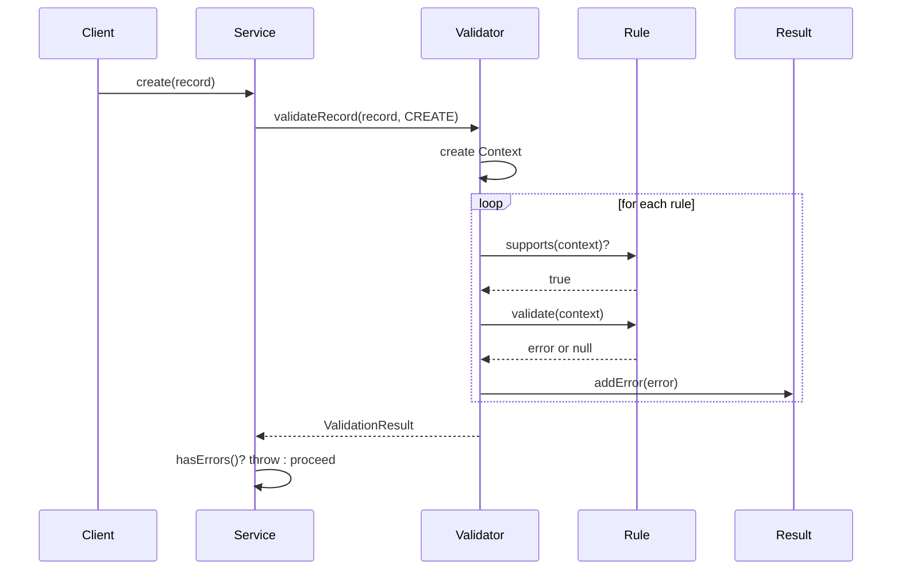
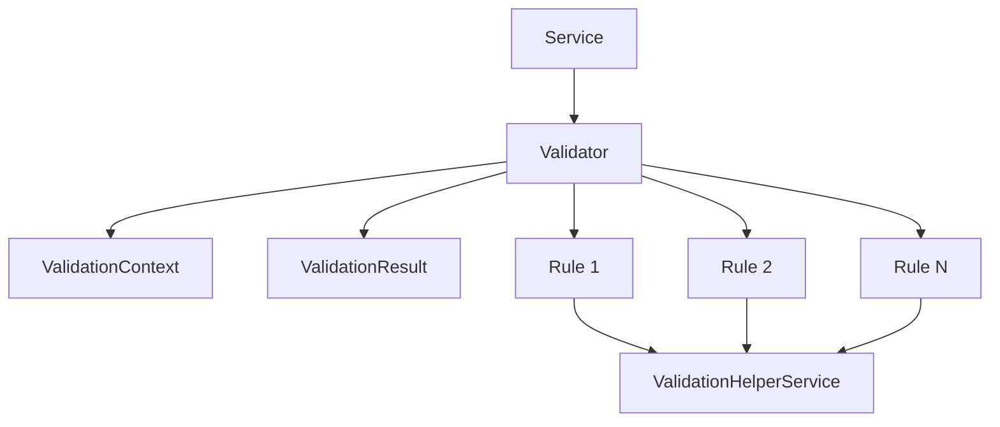

# Validation System - Référence Technique

## Description

Le système de validation de Laravel Chronos est un moteur de validation extensible qui vérifie les règles métier pour les entités Availability, Schedule et Impediment. Il est basé sur un pattern Strategy où chaque règle de validation est une classe implémentant une interface commune.

## Architecture

```
┌─────────────────────────────────────────────────────────────────┐
│                      ValidationContext                          │
│  Encapsule les données de validation (record, operation, etc.)  │
└─────────────────────────────────────────────────────────────────┘
                                │
                                ▼
┌─────────────────────────────────────────────────────────────────┐
│                         Validator                               │
│  Orchestre l'exécution des règles pour une entité donnée        │
└─────────────────────────────────────────────────────────────────┘
                                │
                                ▼
┌─────────────────────────────────────────────────────────────────┐
│                     ValidationRule                              │
│  Interface implémentée par chaque règle de validation           │
└─────────────────────────────────────────────────────────────────┘
                                │
        ┌───────────────────────┼───────────────────────┐
        ▼                       ▼                       ▼
┌───────────────┐    ┌───────────────┐    ┌───────────────┐
│ Availability  │    │   Schedule    │    │   Impediment  │
│    Rules      │    │    Rules      │    │    Rules      │
└───────────────┘    └───────────────┘    └───────────────┘
```

---

## Composants Principaux

### 1. ValidationContext

**Description :** Contexte de validation qui encapsule toutes les données nécessaires à la validation.

| Propriété | Type | Description |
|-----------|------|-------------|
| `$record` | `AbstractRecord` | Le record à valider |
| `$operation` | `OperationType` | Type d'opération (CREATE, UPDATE, DELETE) |
| `$existingEntity` | `Model|null` | Entité existante pour les updates/deletes |

**Méthodes :**
- `getRecord(): AbstractRecord` - Retourne le record
- `getOperation(): OperationType` - Retourne l'opération
- `getEntityType(): EntityType` - Retourne le type d'entité
- `getExistingEntity(): ?Model` - Retourne l'entité existante
- `isCreate(): bool` - Vérifie si c'est une création
- `isUpdate(): bool` - Vérifie si c'est une mise à jour
- `isDelete(): bool` - Vérifie si c'est une suppression
- `hasExistingEntity(): bool` - Vérifie si une entité existante est présente

**Exemple :**
```php
$context = new ValidationContext($record, OperationType::CREATE);
if ($context->isCreate()) {
    // Logique spécifique à la création
}
```

---

### 2. ValidationResult

**Description :** Résultat d'une opération de validation contenant les erreurs.

| Méthode | Retour | Description |
|---------|--------|-------------|
| `addError(ValidationErrorRecord $error)` | `self` | Ajoute une erreur |
| `merge(ValidationResult $other)` | `self` | Fusionne un autre résultat |
| `hasErrors()` | `bool` | Vérifie s'il y a des erreurs |
| `getErrors()` | `ValidationErrorCollection` | Retourne les erreurs |
| `getMessages()` | `array` | Retourne les messages |
| `hasErrorFor(string $field)` | `bool` | Vérifie les erreurs pour un champ |
| `getErrorsFor(string $field)` | `ValidationErrorCollection` | Erreurs pour un champ |
| `getFirstErrorFor(string $field)` | `string|null` | Premier message d'erreur |
| `isEmpty()` | `bool` | Vérifie si vide |
| `count()` | `int` | Nombre d'erreurs |
| `success()` | `self` | Factory pour résultat vide |
| `failure(ValidationErrorRecord\|array $errors)` | `self` | Factory avec erreurs |

**Exemple :**
```php
$result = ValidationResult::failure(
    new ValidationErrorRecord('email', 'Invalid email')
);

if ($result->hasErrorFor('email')) {
    $message = $result->getFirstErrorFor('email');
}
```

---

### 3. ValidationErrorRecord

**Description :** Enregistrement d'une erreur de validation individuelle.

| Propriété | Type | Description |
|-----------|------|-------------|
| `$rule` | `string` | Nom de la classe de la règle |
| `$message` | `string` | Message d'erreur |
| `$context` | `Associative|null` | Contexte supplémentaire |

**Exemple :**
```php
$error = new ValidationErrorRecord(
    rule: MaxDurationRule::class,
    message: 'Duration exceeds maximum allowed',
    context: Associative::from(['duration' => 120, 'max' => 60])
);
```

---

### 4. Validator

**Description :** Orchestrateur principal qui exécute les règles enregistrées.

**Méthodes :**
- `addRule(EntityType $entityType, ValidationRule $rule): self`
- `addRules(EntityType $entityType, array $rules): self`
- `validate(ValidationContext $context): ValidationResult`
- `validateRecord(AbstractRecord $record, OperationType $operation, ?Model $existingEntity = null): ValidationResult`
- `getRules(): array`
- `getRulesForEntity(EntityType $entityType): array`
- `hasRulesForEntity(EntityType $entityType): bool`

**Exemple :**
```php
$validator = new Validator();
$validator->addRule(EntityType::AVAILABILITY, new AvailabilityDaysFormatRule());

$result = $validator->validateRecord($record, OperationType::CREATE);
```

---

## Règles de Validation Disponibles

### A. Rules for Availability

#### AvailabilityRequiredFieldsRule
Vérifie que tous les champs requis sont présents lors de la création.

| Champ | Description |
|-------|-------------|
| `name` | Nom de la disponibilité |
| `daily_start` | Heure de début |
| `daily_end` | Heure de fin |
| `schedulable_type` | Type d'entité |
| `schedulable_id` | ID de l'entité |

**Exemple d'erreur :** `The following fields are required for availability creation: daily_start, daily_end`

---

#### AvailabilityDaysFormatRule
Valide le format et l'intégrité des jours.

| Validation | Description |
|------------|-------------|
| Au moins un jour | La collection ne peut pas être vide |
| Jours valides | Doivent être des valeurs WeekDay |
| Pas de doublons | Chaque jour ne peut apparaître qu'une fois |

**Exemple d'erreur :** `Invalid day(s): invalid. Allowed days are: monday, tuesday...`

---

#### AvailabilityValidDateRangeRule
Valide l'intégrité des plages horaires.

| Validation | Règle |
|------------|-------|
| Daily start < daily end | Sauf pour cross-day (start > end) |
| Validity start < validity end | Start doit être avant end |
| Validity dates requis | Pour CREATE uniquement |

**Exemple d'erreur :** `Validity start date must be before validity end date.`

---

#### AvailabilityMinimumDurationRule
Vérifie la durée minimale configurée.

**Configuration :** `chronos.min_durations.availability`

**Exemple d'erreur :** `Availability duration must be at least 15 minutes. Current duration: 5 minutes.`

---

#### AvailabilityNoOverlapRule
Prévient le chevauchement des disponibilités.

**Vérifie :**
- Chevauchement des jours
- Chevauchement des horaires
- Chevauchement des périodes de validité

**Exemple d'erreur :** `Availability overlaps with existing availability #42 for the same schedulable entity.`

---

#### CrossDayAvailabilityRule
Valide les disponibilités cross-day (start > end).

| Règle | Description |
|-------|-------------|
| Au moins 2 jours | Pour couvrir le début et la fin |
| Jours consécutifs | Les jours doivent se suivre |

**Exemple d'erreur :** `Availability crosses midnight but days array is not consecutive. Days: monday, wednesday`

---

#### DaysWithinValidityPeriodRule
Vérifie que les jours existent dans la période de validité.

**Exemple d'erreur :** `Day(s) saturday are not within the validity period (2024-01-01 to 2024-12-31).`

---

#### NoFutureBookingsOnDeleteRule
Empêche la suppression d'une disponibilité avec réservations futures.

**Exemple d'erreur :** `Cannot delete availability that has future bookings.`

---

#### SchedulableExistsRule
Vérifie que l'entité planifiable existe.

| Validation | Description |
|------------|-------------|
| Classe existe | La classe doit être chargée |
| Entité existe | L'entité doit exister en base |

**Exemple d'erreur :** `Schedulable entity #42 of type "User" does not exist.`

---

### B. Rules for Schedule & Impediment (Shared)

#### TimeSlotChronologyRule
Valide la chronologie des créneaux.

| Validation | Règle |
|------------|-------|
| Start < end | La date de début doit être avant la fin |
| Duration > 0 | La durée doit être positive |

**Exemple d'erreur :** `Start datetime must be before end datetime.`

---

#### MaxDurationRule
Vérifie la durée maximale configurée.

**Configuration :** `chronos.max_duration`

**Exemple d'erreur :** `Duration (4 hours 30 minutes) exceeds maximum allowed duration (4 hours).`

---

#### MinSlotSearchDurationRule
Vérifie la durée minimale de recherche.

**Configuration :** `chronos.min_durations.slot_search`

**Exemple d'erreur :** `Slot duration (1 minutes) is too short. Minimum allowed duration for slot search is 5 minutes.`

---

#### BufferTimeRule
Enforce le temps de buffer entre les événements consécutifs.

**Configuration :** `chronos.buffer_time`

**Exemple d'erreur :** `Buffer time of 15 minutes not respected between previous schedule #42 (ending at 2024-01-15 10:00:00) and the new slot.`

---

#### NoTemporalConflictRule
Prévient les conflits temporels entre schedules et impediments.

**Exemple d'erreur :** `Time slot 2024-01-15 10:30:00 to 2024-01-15 11:30:00 conflicts with existing schedule #42 (2024-01-15 10:00:00 to 2024-01-15 11:00:00).`

---

#### AvailabilityOwnershipValidationRule
Valide que la disponibilité référencée appartient à la bonne entité.

**Exemple d'erreur :** `Availability #42 does not belong to this schedulable entity (User#5).`

---

#### TimeSlotWithinAvailabilityRule
Valide que le créneau est dans les contraintes de la disponibilité parente.

**Vérifie :**
- Période de validité
- Horaires journaliers
- Jours autorisés

**Exemple d'erreur :** `Day "saturday" is not allowed for this availability. Allowed days: monday, tuesday, wednesday`

---

#### EntityOwnershipConsistencyRule
Vérifie la cohérence de propriété entre l'entité enfant et la disponibilité parente.

**Exemple d'erreur :** `The schedule entity (User#5) does not match the parent availability entity (Location#2).`

---

## Configuration

```php
return [
    'min_durations' => [
        'availability' => 15,    // Durée minimale pour Availability
        'schedule' => 15,        // Durée minimale pour Schedule
        'impediment' => 15,      // Durée minimale pour Impediment
        'slot_search' => 5,      // Durée minimale pour les recherches de slots
    ],
    'max_duration' => 240,       // Durée maximale en minutes (4 heures)
    'buffer_time' => 0,          // Temps de buffer en minutes
];
```

---

## Enregistrement des Règles

Les règles sont enregistrées dans le ServiceProvider :

```php
$validator->addRules(EntityType::AVAILABILITY, [
    new AvailabilityRequiredFieldsRule(),
    new AvailabilityDaysFormatRule(),
    new AvailabilityMinimumDurationRule($helper, $config),
    // ...
]);

$validator->addRules(EntityType::SCHEDULE, [
    new NoTemporalConflictRule(),
    new MaxDurationRule($helper, $config),
    new BufferTimeRule($helper, $config),
    // ...
]);
```

---

## Flux de Validation



---

## Intégration



---

## Bonnes Pratiques

### Créer une Nouvelle Règle

```php
final class MyCustomRule implements ValidationRule
{
    public function getDescription(): string
    {
        return 'Description de la règle';
    }

    public function supports(ValidationContext $context): bool
    {
        return $context->getEntityType() === EntityType::SCHEDULE
            && $context->isCreate();
    }

    public function validate(ValidationContext $context): ?ValidationErrorRecord
    {
        // Logique de validation
        if ($condition) {
            return new ValidationErrorRecord(
                rule: self::class,
                message: 'Erreur de validation',
                context: Associative::from(['field' => 'value'])
            );
        }
        return null;
    }
}
```

### Enregistrer la Règle

```php
$validator->addRule(EntityType::SCHEDULE, new MyCustomRule());
```

---

## Compatibilité

| Version | Support |
|---------|---------|
| PHP 8.1+ | ✅ Complet |
| PHP 8.0 | ✅ Complet |
| Laravel 9.x | ✅ Complet |
| Laravel 10.x | ✅ Complet |

---

## Voir aussi

- `ValidationRule` - Interface des règles
- `ValidatorInterface` - Interface du validateur
- `ValidationHelperService` - Service d'aide
- `ValidationErrorRecord` - Record d'erreur
- `ValidationResult` - Résultat de validation
- `ValidationContext` - Contexte de validation
- `EntityType` - Énumération des entités
- `OperationType` - Énumération des opérations